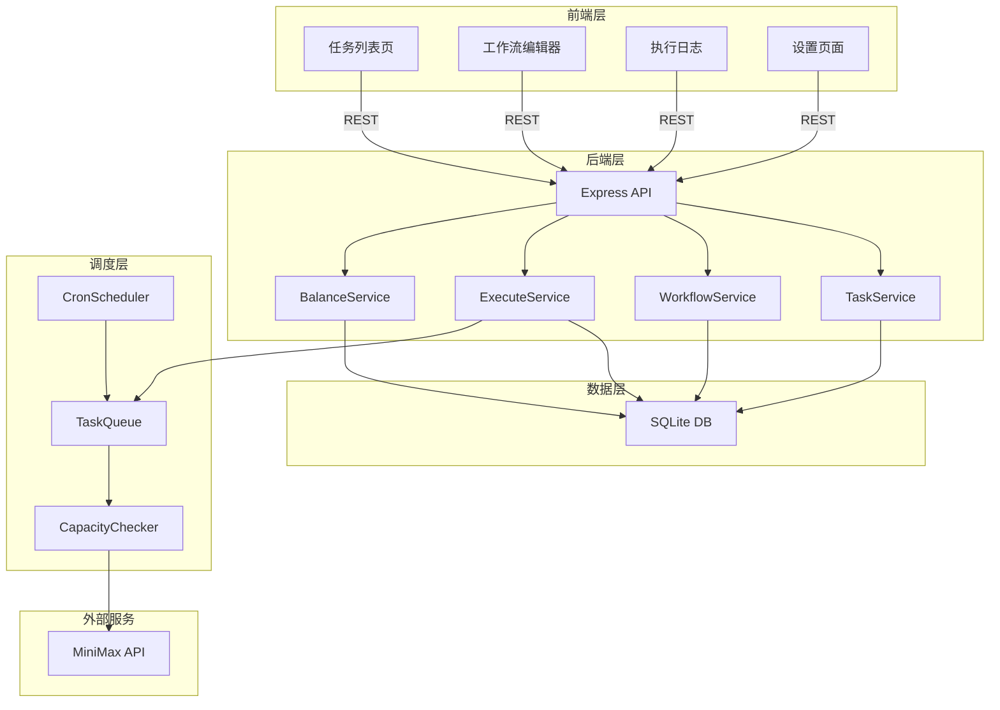
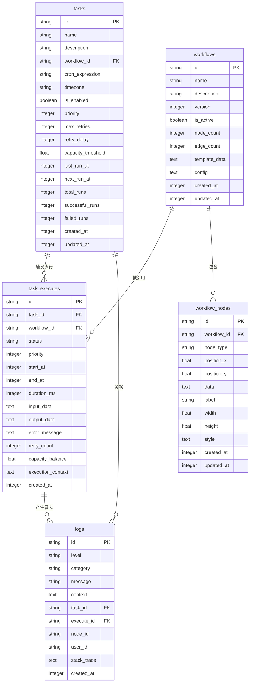
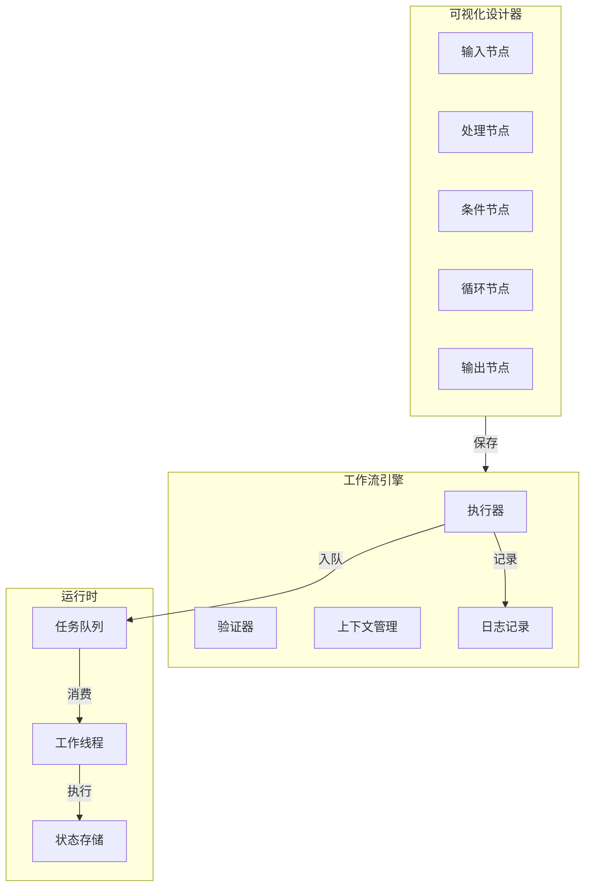
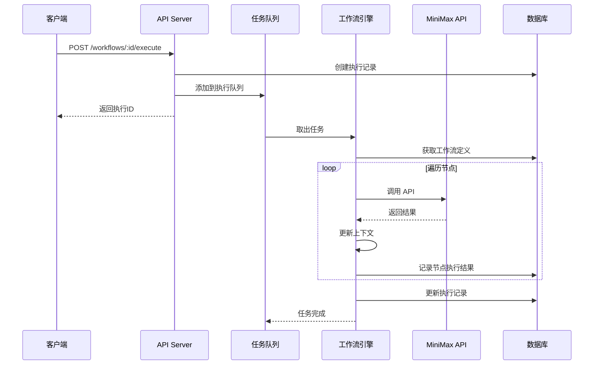
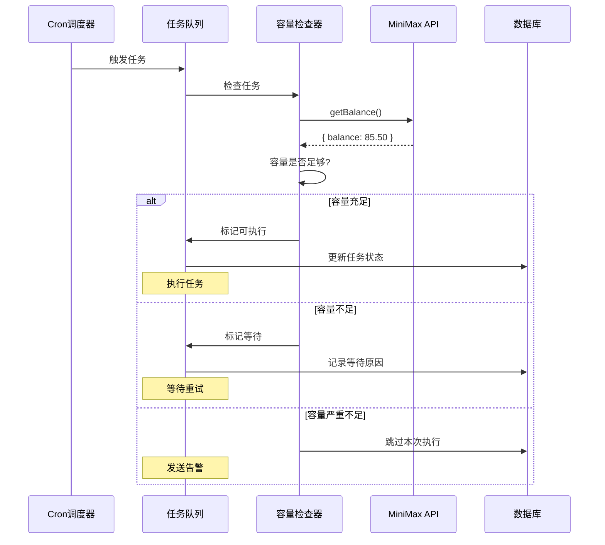
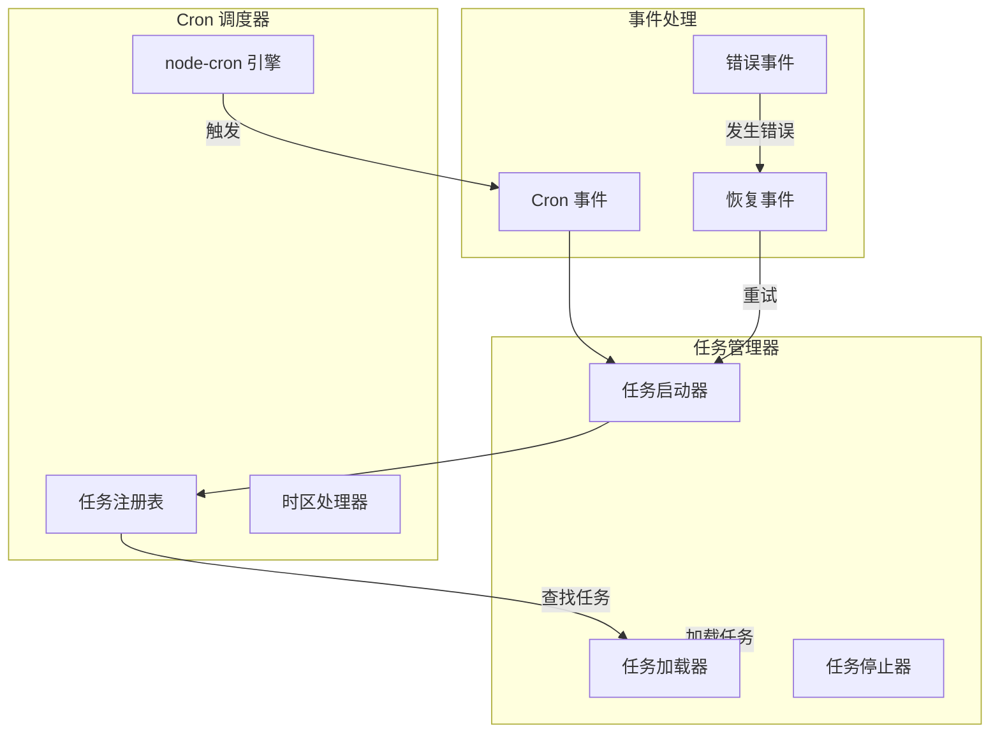
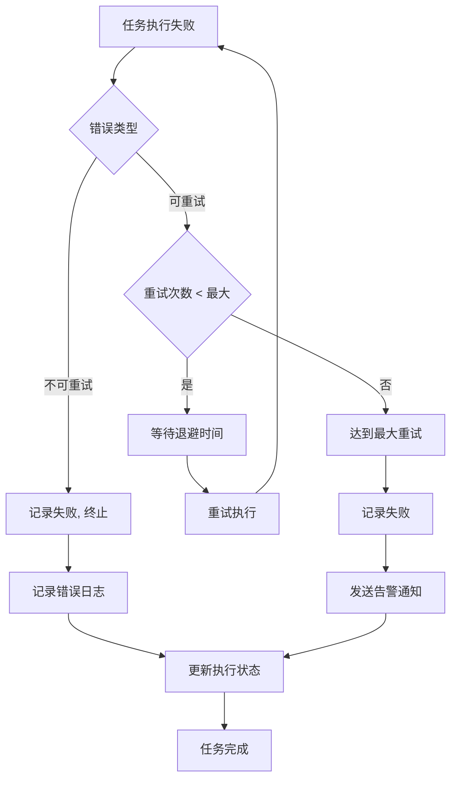
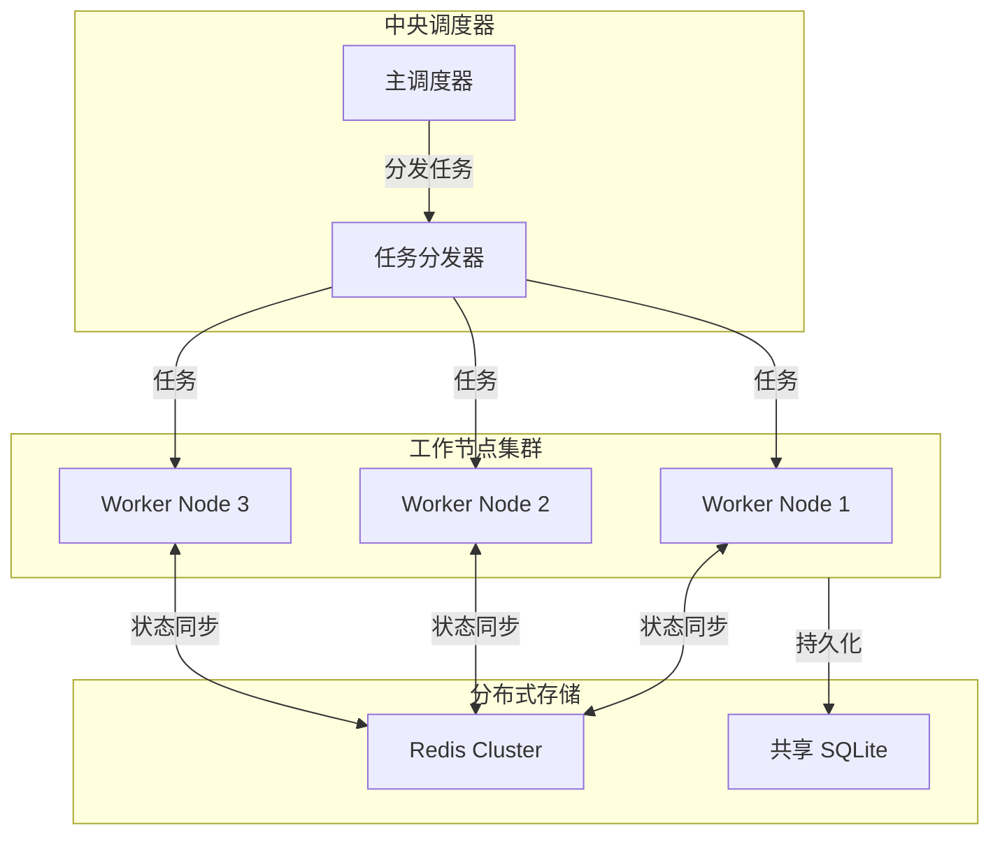

# MiniMax AI 工具集 Cron 任务管理系统设计文档

**文档版本**: v1.0.0  
**创建日期**: 2026-03-31  
**状态**: 设计中

---

## 目录

1. [概述](#1-概述)
2. [系统架构](#2-系统架构)
3. [数据库设计](#3-数据库设计)
4. [API 设计](#4-api-设计)
5. [工作流引擎](#5-工作流引擎)
6. [容量感知调度](#6-容量感知调度)
7. [Cron 调度器](#7-cron-调度器)
8. [前端架构](#8-前端架构)
9. [安全考虑](#9-安全考虑)
10. [性能优化](#10-性能优化)
11. [错误处理](#11-错误处理)
12. [部署指南](#12-部署指南)
13. [未来增强](#13-未来增强)

---

## 1. 概述

### 1.1 系统目的

MiniMax AI 工具集 Cron 任务管理系统是一个为现有 MiniMax AI 工具集添加定时任务调度和可视化工作流构建能力的扩展系统。该系统允许用户：

- 创建基于 Cron 表达式的定时任务
- 通过可视化界面构建复杂的工作流
- 实现 MiniMax API 的自动化调用（文本、语音、图片、音乐、视频生成）
- 根据 MiniMax API 容量余额动态调整任务执行

### 1.2 核心目标

```
┌─────────────────────────────────────────────────────────────┐
│                      核心目标                                │
├─────────────────────────────────────────────────────────────┤
│  1. 定时调度     │ 支持 Cron 表达式的精确任务调度              │
│  2. 可视化工作流 │ 无代码工作流构建器                         │
│  3. 容量感知     │ 根据 API 余额动态调整执行策略              │
│  4. 容错处理     │ 完善的错误重试和恢复机制                   │
│  5. 易于扩展     │ 模块化设计支持未来功能扩展                │
└─────────────────────────────────────────────────────────────┘
```

### 1.3 关键功能特性

| 功能模块 | 描述 |
|---------|------|
| **Cron 管理** | 创建、编辑、删除、启用/禁用定时任务 |
| **工作流设计器** | 拖拽式节点连线，支持条件分支和循环 |
| **任务执行器** | 基于工作流模板的自动化任务执行 |
| **容量监控** | 实时监控 MiniMax API 余额和配额 |
| **执行日志** | 完整的任务执行记录和状态追踪 |
| **队列管理** | 基于优先级的任务队列管理 |

### 1.4 技术栈

```
前端技术栈:
┌─────────────────────────────────────────────────────┐
│  React 18 + Vite + TypeScript                       │
│  ├─ @xyflow/react (流程图/工作流可视化)               │
│  ├─ Zustand (状态管理)                              │
│  ├─ TailwindCSS (UI 样式)                          │
│  └─ React Query (服务端状态管理)                     │
└─────────────────────────────────────────────────────┘

后端技术栈:
┌─────────────────────────────────────────────────────┐
│  Node.js + Express.js                               │
│  ├─ better-sqlite3 (嵌入式数据库)                   │
│  ├─ node-cron (Cron 调度)                           │
│  └─ MiniMax SDK (API 调用)                          │
└─────────────────────────────────────────────────────┘
```

---

## 2. 系统架构

### 2.1 整体架构图

```
┌────────────────────────────────────────────────────────────────────────────┐
│                           MiniMax AI Cron 任务管理系统                          │
├────────────────────────────────────────────────────────────────────────────┤
│                                                                              │
│  ┌──────────────────────────────────────────────────────────────────────┐  │
│  │                           前端层 (React 18)                            │  │
│  │  ┌─────────────┐  ┌─────────────┐  ┌─────────────┐  ┌─────────────┐ │  │
│  │  │  任务列表页  │  │ 工作流设计器 │  │  执行日志页  │  │  设置页面   │ │  │
│  │  └──────┬──────┘  └──────┬──────┘  └──────┬──────┘  └──────┬──────┘ │  │
│  │         │                 │                 │                 │        │  │
│  │         └─────────────────┼─────────────────┼─────────────────┘        │  │
│  │                           │                 │                            │  │
│  │                    ┌──────┴──────────────────┴──────┐                     │  │
│  │                    │         Zustand Store          │                     │  │
│  │                    │   ├─ taskStore (任务状态)       │                     │  │
│  │                    │   ├─ workflowStore (工作流)    │                     │  │
│  │                    │   └─ settingsStore (设置)      │                     │  │
│  │                    └──────────────────┬─────────────┘                     │  │
│  └───────────────────────────────────────┼───────────────────────────────────┘  │
│                                            │                                        │
│                                    REST API │ /api/v1/*                            │
│                                            │                                        │
├────────────────────────────────────────────┼────────────────────────────────────────┤
│                                            ▼                                        │
│  ┌──────────────────────────────────────────────────────────────────────┐       │
│  │                           后端层 (Express.js)                            │       │
│  │                                                                       │       │
│  │  ┌────────────────────────────────────────────────────────────────┐  │       │
│  │  │                      API 路由层 (/api/v1)                        │  │       │
│  │  │  ┌──────────┐ ┌──────────┐ ┌──────────┐ ┌──────────┐ ┌───────┐ │  │       │
│  │  │  │ /tasks   │ │ /workflows│ │ /executes│ │ /balance │ │ /logs │ │  │       │
│  │  │  └────┬─────┘ └────┬─────┘ └────┬─────┘ └────┬─────┘ └───┬───┘ │  │       │
│  │  └───────┼───────────┼───────────┼───────────┼───────────┼──────┘  │       │
│  │  ════════╪═══════════╪═══════════╪═══════════╪═══════════╪═════════  │       │
│  │          │           │           │           │           │           │       │
│  │  ┌───────┴───────────┴───────────┴───────────┴───────────┴──────┐   │       │
│  │  │                      业务逻辑层                               │   │       │
│  │  │  ┌─────────────┐ ┌─────────────┐ ┌─────────────┐ ┌─────────┐ │   │       │
│  │  │  │ TaskService │ │WorkflowService│ │ExecuteService│ │BalanceSvc│ │   │       │
│  │  │  └──────┬──────┘ └──────┬──────┘ └──────┬──────┘ └────┬────┘ │   │       │
│  │  └────────┼────────────────┼────────────────┼─────────────┼─────┘   │       │
│  │  ═════════╪════════════════╪════════════════╪═════════════╪═════════  │       │
│  │           │                │                │             │            │       │
│  │  ┌────────┴────────────────┴────────────────┴─────────────┴─────┐     │       │
│  │  │                        数据访问层                             │     │       │
│  │  │              SQLite Database (better-sqlite3)                │     │       │
│  │  └─────────────────────────────────────────────────────────────┘     │       │
│  │                                                                       │       │
│  │  ┌────────────────────────────────────────────────────────────────┐  │       │
│  │  │                    调度引擎层                                    │  │       │
│  │  │  ┌────────────────┐  ┌────────────────┐  ┌────────────────┐     │  │       │
│  │  │  │  CronScheduler │  │  TaskQueue     │  │ CapacityCheck │     │  │       │
│  │  │  │  (node-cron)   │  │  (Priority Q)  │  │ (MiniMax API) │     │  │       │
│  │  │  └────────┬───────┘  └───────┬────────┘  └───────┬────────┘     │  │       │
│  │  └──────────┼───────────────────┼────────────────────┼──────────────┘  │       │
│  │  ══════════╪═══════════════════╪════════════════════╪═════════════════  │       │
│  │            │                   │                    │                  │       │
│  │            └───────────────────┼────────────────────┘                  │       │
│  │                                │                                       │       │
│  │  ┌─────────────────────────────┴─────────────────────────────────────┐ │       │
│  │  │                    MiniMax API 集成层                              │ │       │
│  │  │     text-generation │ voice-generation │ image-generation        │ │       │
│  │  │     music-generation │ video-generation │ getBalance              │ │       │
│  │  └───────────────────────────────────────────────────────────────────┘ │       │
│  └─────────────────────────────────────────────────────────────────────────┘       │
└─────────────────────────────────────────────────────────────────────────────────────┘
```

### 2.2 数据流图

```
┌─────────────────────────────────────────────────────────────────────────┐
│                          任务数据流                                       │
├─────────────────────────────────────────────────────────────────────────┤
│                                                                          │
│   用户操作              系统处理                  外部交互                │
│      │                    │                        │                     │
│      ▼                    ▼                        ▼                     │
│ ┌─────────┐        ┌─────────────┐         ┌─────────────┐               │
│ │ 创建任务 │──────▶│ 验证 & 存储  │         │             │               │
│ └─────────┘        └──────┬──────┘         │             │               │
│                           │                │   MiniMax   │               │
│                           ▼                │    API      │               │
│                    ┌─────────────┐         │             │               │
│                    │ Cron 调度器  │         │             │               │
│                    │  注册任务    │         └──────┬──────┘               │
│                    └──────┬──────┘                │                      │
│                           │                       │                      │
│                           ▼                       │                      │
│                    ┌─────────────┐                │                      │
│                    │ 容量检查     │◀───────────────┘                      │
│                    └──────┬──────┘                                        │
│                           │                                              │
│              ┌────────────┼────────────┐                                 │
│              │            │            │                                  │
│              ▼            ▼            ▼                                  │
│        ┌─────────┐  ┌─────────┐  ┌─────────┐                              │
│        │  等待中  │  │ 执行任务 │  │  跳过   │                              │
│        │ (队列)  │  │(执行器) │  │(余额不足)│                              │
│        └─────────┘  └────┬────┘  └─────────┘                              │
│                          │                                               │
│                          ▼                                               │
│                   ┌─────────────┐                                         │
│                   │  结果存储   │                                         │
│                   │  & 回调    │                                         │
│                   └─────────────┘                                         │
│                                                                          │
└─────────────────────────────────────────────────────────────────────────┘
```

### 2.3 组件关系图



---

## 3. 数据库设计

### 3.1 数据库概览

```
┌─────────────────────────────────────────────────────────────┐
│                      数据库: minimax_cron.db                │
├─────────────────────────────────────────────────────────────┤
│  5 张核心表:                                                 │
│  ┌───────────────┐  ┌───────────────┐  ┌───────────────┐   │
│  │    tasks      │  │   workflows   │  │ workflow_nodes│   │
│  └───────────────┘  └───────────────┘  └───────────────┘   │
│  ┌───────────────┐  ┌───────────────┐                      │
│  │ task_executes │  │    logs       │                      │
│  └───────────────┘  └───────────────┘                      │
└─────────────────────────────────────────────────────────────┘
```

### 3.2 完整 SQL 架构

```sql
-- ============================================================================
-- MiniMax AI Cron 任务管理系统 - 数据库架构
-- 版本: 1.0.0
-- 描述: 包含任务调度、工作流执行、容量检查的完整数据模型
-- ============================================================================

-- 启用外键约束
PRAGMA foreign_keys = ON;

-- ============================================================================
-- 表1: tasks (定时任务表)
-- ============================================================================
CREATE TABLE IF NOT EXISTS tasks (
    id              TEXT PRIMARY KEY,           -- UUID v4
    name            TEXT NOT NULL,               -- 任务名称
    description     TEXT,                       -- 任务描述
    workflow_id     TEXT NOT NULL,               -- 关联的工作流ID
    cron_expression TEXT NOT NULL,               -- Cron 表达式
    timezone        TEXT DEFAULT 'Asia/Shanghai',-- 时区
    is_enabled     INTEGER DEFAULT 1,            -- 是否启用 (0/1)
    priority        INTEGER DEFAULT 5,           -- 优先级 (1-10, 1最高)
    max_retries     INTEGER DEFAULT 3,           -- 最大重试次数
    retry_delay     INTEGER DEFAULT 60000,       -- 重试延迟(ms)
    capacity_threshold REAL DEFAULT 0.1,         -- 容量阈值 (10%)
    last_run_at     INTEGER,                     -- 上次执行时间戳
    next_run_at     INTEGER,                     -- 下次执行时间戳
    total_runs      INTEGER DEFAULT 0,           -- 总执行次数
    successful_runs INTEGER DEFAULT 0,           -- 成功次数
    failed_runs     INTEGER DEFAULT 0,           -- 失败次数
    created_at      INTEGER NOT NULL,            -- 创建时间戳
    updated_at      INTEGER NOT NULL,            -- 更新时间戳
    
    FOREIGN KEY (workflow_id) REFERENCES workflows(id) ON DELETE CASCADE
);

-- 任务表索引
CREATE INDEX idx_tasks_workflow_id ON tasks(workflow_id);
CREATE INDEX idx_tasks_is_enabled ON tasks(is_enabled);
CREATE INDEX idx_tasks_next_run_at ON tasks(next_run_at);
CREATE INDEX idx_tasks_priority ON tasks(priority);

-- ============================================================================
-- 表2: workflows (工作流表)
-- ============================================================================
CREATE TABLE IF NOT EXISTS workflows (
    id              TEXT PRIMARY KEY,            -- UUID v4
    name            TEXT NOT NULL,               -- 工作流名称
    description     TEXT,                        -- 工作流描述
    version         INTEGER DEFAULT 1,           -- 版本号
    is_active       INTEGER DEFAULT 1,           -- 是否激活
    node_count      INTEGER DEFAULT 0,           -- 节点数量
    edge_count      INTEGER DEFAULT 0,          -- 边数量
    template_data   TEXT,                       -- 模板 JSON 数据
    config          TEXT,                        -- 额外配置
    created_at      INTEGER NOT NULL,
    updated_at      INTEGER NOT NULL
);

-- 工作流表索引
CREATE INDEX idx_workflows_is_active ON workflows(is_active);
CREATE INDEX idx_workflows_name ON workflows(name);

-- ============================================================================
-- 表3: workflow_nodes (工作流节点表)
-- ============================================================================
CREATE TABLE IF NOT EXISTS workflow_nodes (
    id              TEXT PRIMARY KEY,            -- UUID v4
    workflow_id     TEXT NOT NULL,               -- 所属工作流ID
    node_type       TEXT NOT NULL,               -- 节点类型
    position_x      REAL NOT NULL,               -- X坐标
    position_y      REAL NOT NULL,               -- Y坐标
    data            TEXT NOT NULL,               -- 节点数据 JSON
    label           TEXT,                         -- 显示标签
    width           REAL,                         -- 节点宽度
    height          REAL,                         -- 节点高度
    style           TEXT,                         -- 样式 JSON
    created_at      INTEGER NOT NULL,
    updated_at      INTEGER NOT NULL,
    
    FOREIGN KEY (workflow_id) REFERENCES workflows(id) ON DELETE CASCADE
);

-- 节点表索引
CREATE INDEX idx_workflow_nodes_workflow_id ON workflow_nodes(workflow_id);
CREATE INDEX idx_workflow_nodes_node_type ON workflow_nodes(node_type);

-- ============================================================================
-- 表4: task_executes (任务执行记录表)
-- ============================================================================
CREATE TABLE IF NOT EXISTS task_executes (
    id                  TEXT PRIMARY KEY,        -- UUID v4
    task_id             TEXT NOT NULL,            -- 任务ID
    workflow_id         TEXT NOT NULL,           -- 工作流ID
    status              TEXT NOT NULL,            -- pending/running/success/failed/skipped
    priority            INTEGER,                  -- 执行时优先级
    start_at            INTEGER,                  -- 开始时间戳
    end_at              INTEGER,                  -- 结束时间戳
    duration_ms         INTEGER,                  -- 执行时长(ms)
    input_data          TEXT,                     -- 输入数据 JSON
    output_data         TEXT,                     -- 输出数据 JSON
    error_message       TEXT,                     -- 错误信息
    retry_count         INTEGER DEFAULT 0,        -- 重试次数
    capacity_balance    REAL,                     -- 执行时余额
    execution_context   TEXT,                     -- 执行上下文 JSON
    created_at          INTEGER NOT NULL,
    
    FOREIGN KEY (task_id) REFERENCES tasks(id) ON DELETE CASCADE,
    FOREIGN KEY (workflow_id) REFERENCES workflows(id) ON DELETE CASCADE
);

-- 执行记录表索引
CREATE INDEX idx_task_executes_task_id ON task_executes(task_id);
CREATE INDEX idx_task_executes_workflow_id ON task_executes(workflow_id);
CREATE INDEX idx_task_executes_status ON task_executes(status);
CREATE INDEX idx_task_executes_created_at ON task_executes(created_at);
CREATE INDEX idx_task_executes_task_status ON task_executes(task_id, status);

-- ============================================================================
-- 表5: logs (系统日志表)
-- ============================================================================
CREATE TABLE IF NOT EXISTS logs (
    id              TEXT PRIMARY KEY,            -- UUID v4
    level           TEXT NOT NULL,                -- debug/info/warn/error
    category        TEXT NOT NULL,                -- 日志分类
    message         TEXT NOT NULL,                -- 日志消息
    context         TEXT,                         -- 上下文 JSON
    task_id         TEXT,                         -- 关联任务ID
    execute_id      TEXT,                         -- 关联执行ID
    node_id         TEXT,                          -- 关联节点ID
    user_id         TEXT,                         -- 用户ID
    stack_trace     TEXT,                         -- 堆栈跟踪
    created_at      INTEGER NOT NULL,
    
    FOREIGN KEY (task_id) REFERENCES tasks(id) ON DELETE SET NULL,
    FOREIGN KEY (execute_id) REFERENCES task_executes(id) ON DELETE SET NULL
);

-- 日志表索引
CREATE INDEX idx_logs_level ON logs(level);
CREATE INDEX idx_logs_category ON logs(category);
CREATE INDEX idx_logs_task_id ON logs(task_id);
CREATE INDEX idx_logs_execute_id ON logs(execute_id);
CREATE INDEX idx_logs_created_at ON logs(created_at);
CREATE INDEX idx_logs_level_created ON logs(level, created_at);

-- ============================================================================
-- 触发器: 自动更新工作流统计
-- ============================================================================
CREATE TRIGGER IF NOT EXISTS update_workflow_stats_after_node_insert
AFTER INSERT ON workflow_nodes
FOR EACH ROW
BEGIN
    UPDATE workflows 
    SET node_count = (SELECT COUNT(*) FROM workflow_nodes WHERE workflow_id = NEW.workflow_id),
        updated_at = UNIXEPOCH()
    WHERE id = NEW.workflow_id;
END;

CREATE TRIGGER IF NOT EXISTS update_workflow_stats_after_node_delete
AFTER DELETE ON workflow_nodes
FOR EACH ROW
BEGIN
    UPDATE workflows 
    SET node_count = (SELECT COUNT(*) FROM workflow_nodes WHERE workflow_id = OLD.workflow_id),
        updated_at = UNIXEPOCH()
    WHERE id = OLD.workflow_id;
END;

-- ============================================================================
-- 视图: 任务执行统计视图
-- ============================================================================
CREATE VIEW IF NOT EXISTS v_task_statistics AS
SELECT 
    t.id,
    t.name,
    t.total_runs,
    t.successful_runs,
    t.failed_runs,
    CASE 
        WHEN t.total_runs > 0 
        THEN ROUND(CAST(t.successful_runs AS REAL) / t.total_runs * 100, 2)
        ELSE 0 
    END AS success_rate,
    t.last_run_at,
    t.next_run_at,
    w.name AS workflow_name
FROM tasks t
JOIN workflows w ON t.workflow_id = w.id;
```

### 3.3 实体关系图



---

## 4. API 设计

### 4.1 API 概览

```
基础路径: /api/v1
认证方式: API Key (X-API-Key header)
内容类型: application/json
字符编码: UTF-8

状态码:
├── 200 OK              - 请求成功
├── 201 Created         - 资源创建成功
├── 400 Bad Request     - 请求参数错误
├── 401 Unauthorized     - 认证失败
├── 403 Forbidden       - 权限不足
├── 404 Not Found       - 资源不存在
├── 409 Conflict        - 资源冲突
├── 422 Unprocessable   - 业务逻辑错误
├── 429 Too Many        - 请求过于频繁
└── 500 Internal Error  - 服务器内部错误
```

### 4.2 端点列表

| # | 方法 | 路径 | 描述 | 标签 |
|---|------|------|------|------|
| 1 | GET | /health | 健康检查 | 系统 |
| 2 | GET | /tasks | 获取任务列表 | 任务 |
| 3 | POST | /tasks | 创建任务 | 任务 |
| 4 | GET | /tasks/:id | 获取任务详情 | 任务 |
| 5 | PUT | /tasks/:id | 更新任务 | 任务 |
| 6 | DELETE | /tasks/:id | 删除任务 | 任务 |
| 7 | POST | /tasks/:id/enable | 启用任务 | 任务 |
| 8 | POST | /tasks/:id/disable | 禁用任务 | 任务 |
| 9 | GET | /tasks/:id/executes | 获取任务执行历史 | 任务 |
| 10 | GET | /workflows | 获取工作流列表 | 工作流 |
| 11 | POST | /workflows | 创建工作流 | 工作流 |
| 12 | GET | /workflows/:id | 获取工作流详情 | 工作流 |
| 13 | PUT | /workflows/:id | 更新工作流 | 工作流 |
| 14 | DELETE | /workflows/:id | 删除工作流 | 工作流 |
| 15 | GET | /workflows/:id/nodes | 获取工作流节点 | 工作流 |
| 16 | PUT | /workflows/:id/nodes | 更新工作流节点 | 工作流 |
| 17 | POST | /workflows/:id/execute | 手动执行工作流 | 工作流 |
| 18 | GET | /executes | 获取执行记录列表 | 执行 |
| 19 | GET | /executes/:id | 获取执行详情 | 执行 |
| 20 | GET | /balance | 获取容量余额 | 容量 |
| 21 | GET | /logs | 获取系统日志 | 日志 |

### 4.3 详细 API 规范

#### 4.3.1 健康检查

```
GET /api/v1/health
```

**响应示例:**
```json
{
  "success": true,
  "data": {
    "status": "healthy",
    "version": "1.0.0",
    "uptime": 3600,
    "timestamp": 1743446400,
    "services": {
      "database": "connected",
      "scheduler": "running",
      "queue": "idle"
    }
  }
}
```

#### 4.3.2 任务管理 API

```
GET /api/v1/tasks
```

**查询参数:**
| 参数 | 类型 | 默认值 | 描述 |
|------|------|--------|------|
| page | number | 1 | 页码 |
| limit | number | 20 | 每页数量 |
| status | string | - | enabled/disabled |
| search | string | - | 搜索关键词 |

**响应示例:**
```json
{
  "success": true,
  "data": {
    "items": [
      {
        "id": "task_abc123",
        "name": "每日文案生成",
        "description": "每天自动生成营销文案",
        "workflow_id": "wf_xyz789",
        "cron_expression": "0 8 * * *",
        "timezone": "Asia/Shanghai",
        "is_enabled": true,
        "priority": 3,
        "max_retries": 3,
        "last_run_at": 1743442800,
        "next_run_at": 1743529200,
        "total_runs": 150,
        "successful_runs": 145,
        "failed_runs": 5,
        "success_rate": 96.67,
        "created_at": 1743356400,
        "updated_at": 1743446400
      }
    ],
    "pagination": {
      "page": 1,
      "limit": 20,
      "total": 45,
      "total_pages": 3
    }
  }
}
```

```
POST /api/v1/tasks
```

**请求体:**
```json
{
  "name": "每日文案生成",
  "description": "每天自动生成营销文案",
  "workflow_id": "wf_xyz789",
  "cron_expression": "0 8 * * *",
  "timezone": "Asia/Shanghai",
  "priority": 3,
  "max_retries": 3,
  "retry_delay": 60000,
  "capacity_threshold": 0.1
}
```

**响应示例:**
```json
{
  "success": true,
  "data": {
    "id": "task_abc123",
    "name": "每日文案生成",
    "description": "每天自动生成营销文案",
    "workflow_id": "wf_xyz789",
    "cron_expression": "0 8 * * *",
    "timezone": "Asia/Shanghai",
    "is_enabled": true,
    "priority": 3,
    "max_retries": 3,
    "retry_delay": 60000,
    "capacity_threshold": 0.1,
    "last_run_at": null,
    "next_run_at": 1743529200,
    "total_runs": 0,
    "successful_runs": 0,
    "failed_runs": 0,
    "created_at": 1743446400,
    "updated_at": 1743446400
  }
}
```

```
PUT /api/v1/tasks/:id
```

**请求体:**
```json
{
  "name": "每日文案生成 V2",
  "cron_expression": "0 9 * * *",
  "priority": 2,
  "capacity_threshold": 0.15
}
```

```
POST /api/v1/tasks/:id/enable
```

**响应示例:**
```json
{
  "success": true,
  "data": {
    "id": "task_abc123",
    "is_enabled": true,
    "next_run_at": 1743529200,
    "message": "任务已启用"
  }
}
```

```
POST /api/v1/tasks/:id/disable
```

**响应示例:**
```json
{
  "success": true,
  "data": {
    "id": "task_abc123",
    "is_enabled": false,
    "message": "任务已禁用"
  }
}
```

```
GET /api/v1/tasks/:id/executes
```

**查询参数:**
| 参数 | 类型 | 默认值 | 描述 |
|------|------|--------|------|
| page | number | 1 | 页码 |
| limit | number | 20 | 每页数量 |
| status | string | - | pending/running/success/failed/skipped |

**响应示例:**
```json
{
  "success": true,
  "data": {
    "items": [
      {
        "id": "exec_def456",
        "task_id": "task_abc123",
        "workflow_id": "wf_xyz789",
        "status": "success",
        "start_at": 1743442800,
        "end_at": 1743442815,
        "duration_ms": 15000,
        "retry_count": 0,
        "capacity_balance": 85.5,
        "created_at": 1743442800
      }
    ],
    "pagination": {
      "page": 1,
      "limit": 20,
      "total": 150,
      "total_pages": 8
    }
  }
}
```

#### 4.3.3 工作流管理 API

```
GET /api/v1/workflows
```

**查询参数:**
| 参数 | 类型 | 默认值 | 描述 |
|------|------|--------|------|
| page | number | 1 | 页码 |
| limit | number | 20 | 每页数量 |
| search | string | - | 搜索关键词 |

**响应示例:**
```json
{
  "success": true,
  "data": {
    "items": [
      {
        "id": "wf_xyz789",
        "name": "营销文案工作流",
        "description": "输入主题，生成完整营销文案",
        "version": 1,
        "is_active": true,
        "node_count": 5,
        "edge_count": 4,
        "created_at": 1743356400,
        "updated_at": 1743446400
      }
    ],
    "pagination": {
      "page": 1,
      "limit": 20,
      "total": 12,
      "total_pages": 1
    }
  }
}
```

```
POST /api/v1/workflows
```

**请求体:**
```json
{
  "name": "营销文案工作流",
  "description": "输入主题，生成完整营销文案",
  "nodes": [
    {
      "id": "node_1",
      "type": "input",
      "position": { "x": 100, "y": 200 },
      "data": { "label": "主题输入", "fields": ["topic"] }
    },
    {
      "id": "node_2",
      "type": "textGeneration",
      "position": { "x": 300, "y": 200 },
      "data": { 
        "label": "生成文案", 
        "model": "abab6.5s",
        "prompt": "请为{{topic}}生成一段营销文案" 
      }
    },
    {
      "id": "node_3",
      "type": "output",
      "position": { "x": 500, "y": 200 },
      "data": { "label": "输出结果" }
    }
  ],
  "edges": [
    { "id": "edge_1", "source": "node_1", "target": "node_2" },
    { "id": "edge_2", "source": "node_2", "target": "node_3" }
  ]
}
```

**响应示例:**
```json
{
  "success": true,
  "data": {
    "id": "wf_xyz789",
    "name": "营销文案工作流",
    "description": "输入主题，生成完整营销文案",
    "version": 1,
    "is_active": true,
    "node_count": 3,
    "edge_count": 2,
    "nodes": [...],
    "edges": [...],
    "created_at": 1743446400,
    "updated_at": 1743446400
  }
}
```

```
GET /api/v1/workflows/:id
```

**响应示例:**
```json
{
  "success": true,
  "data": {
    "id": "wf_xyz789",
    "name": "营销文案工作流",
    "description": "输入主题，生成完整营销文案",
    "version": 2,
    "is_active": true,
    "node_count": 5,
    "edge_count": 6,
    "nodes": [
      {
        "id": "node_1",
        "type": "input",
        "position": { "x": 100, "y": 200 },
        "data": { "label": "主题输入", "fields": ["topic"] },
        "style": { "backgroundColor": "#e3f2fd" }
      }
    ],
    "edges": [
      {
        "id": "edge_1",
        "source": "node_1",
        "target": "node_2",
        "type": "default"
      }
    ],
    "created_at": 1743356400,
    "updated_at": 1743446400
  }
}
```

```
PUT /api/v1/workflows/:id
```

**请求体:**
```json
{
  "name": "营销文案工作流 V2",
  "description": "更新后的描述",
  "nodes": [...],
  "edges": [...]
}
```

```
GET /api/v1/workflows/:id/nodes
```

**响应示例:**
```json
{
  "success": true,
  "data": {
    "workflow_id": "wf_xyz789",
    "nodes": [
      {
        "id": "node_1",
        "node_type": "input",
        "position_x": 100,
        "position_y": 200,
        "data": { "label": "主题输入", "fields": ["topic"] },
        "label": "主题输入",
        "width": 200,
        "height": 100,
        "style": { "backgroundColor": "#e3f2fd" }
      }
    ]
  }
}
```

```
PUT /api/v1/workflows/:id/nodes
```

**请求体:**
```json
{
  "nodes": [
    {
      "id": "node_1",
      "position_x": 150,
      "position_y": 250,
      "data": { "label": "新标签", "fields": ["topic", "style"] }
    }
  ]
}
```

```
POST /api/v1/workflows/:id/execute
```

**请求体:**
```json
{
  "input_data": {
    "topic": "夏季防晒产品推广"
  },
  "priority": 5
}
```

**响应示例:**
```json
{
  "success": true,
  "data": {
    "execute_id": "exec_ghi789",
    "task_id": null,
    "workflow_id": "wf_xyz789",
    "status": "pending",
    "input_data": {
      "topic": "夏季防晒产品推广"
    },
    "queue_position": 3,
    "estimated_wait_seconds": 15
  }
}
```

#### 4.3.4 执行记录 API

```
GET /api/v1/executes
```

**查询参数:**
| 参数 | 类型 | 默认值 | 描述 |
|------|------|--------|------|
| page | number | 1 | 页码 |
| limit | number | 20 | 每页数量 |
| status | string | - | pending/running/success/failed/skipped |
| task_id | string | - | 按任务筛选 |
| start_date | number | - | 开始时间戳 |
| end_date | number | - | 结束时间戳 |

**响应示例:**
```json
{
  "success": true,
  "data": {
    "items": [
      {
        "id": "exec_def456",
        "task_id": "task_abc123",
        "task_name": "每日文案生成",
        "workflow_name": "营销文案工作流",
        "status": "success",
        "priority": 3,
        "start_at": 1743442800,
        "end_at": 1743442815,
        "duration_ms": 15000,
        "retry_count": 0,
        "capacity_balance": 85.5,
        "created_at": 1743442800
      }
    ],
    "pagination": {
      "page": 1,
      "limit": 20,
      "total": 500,
      "total_pages": 25
    }
  }
}
```

```
GET /api/v1/executes/:id
```

**响应示例:**
```json
{
  "success": true,
  "data": {
    "id": "exec_def456",
    "task_id": "task_abc123",
    "task_name": "每日文案生成",
    "workflow_id": "wf_xyz789",
    "workflow_name": "营销文案工作流",
    "status": "success",
    "priority": 3,
    "start_at": 1743442800,
    "end_at": 1743442815,
    "duration_ms": 15000,
    "input_data": {
      "topic": "夏季防晒产品推广"
    },
    "output_data": {
      "content": "# 夏季防晒产品营销文案\n\n炎炎夏日...",
      "word_count": 500,
      "generation_time_ms": 12000
    },
    "error_message": null,
    "retry_count": 0,
    "capacity_balance": 85.5,
    "execution_context": {
      "node_results": {
        "node_1": { "status": "success", "output": { "topic": "夏季防晒产品推广" } },
        "node_2": { "status": "success", "output": { "content": "..." } },
        "node_3": { "status": "success" }
      }
    },
    "created_at": 1743442800
  }
}
```

#### 4.3.5 容量查询 API

```
GET /api/v1/balance
```

**响应示例:**
```json
{
  "success": true,
  "data": {
    "balance": 85.50,
    "currency": "CNY",
    "quota_used_today": 14.50,
    "quota_limit_daily": 100.00,
    "quota_remaining": 85.50,
    "last_checked_at": 1743446400,
    "is_sufficient": true,
    "threshold_warning": false
  }
}
```

#### 4.3.6 日志 API

```
GET /api/v1/logs
```

**查询参数:**
| 参数 | 类型 | 默认值 | 描述 |
|------|------|--------|------|
| page | number | 1 | 页码 |
| limit | number | 50 | 每页数量 |
| level | string | - | debug/info/warn/error |
| category | string | - | 系统/任务/工作流/API |
| task_id | string | - | 按任务筛选 |
| execute_id | string | - | 按执行筛选 |
| start_date | number | - | 开始时间戳 |
| end_date | number | - | 结束时间戳 |

**响应示例:**
```json
{
  "success": true,
  "data": {
    "items": [
      {
        "id": "log_jkl012",
        "level": "info",
        "category": "task",
        "message": "任务执行开始",
        "context": {
          "task_id": "task_abc123",
          "execute_id": "exec_def456"
        },
        "task_id": "task_abc123",
        "execute_id": "exec_def456",
        "created_at": 1743446400
      },
      {
        "id": "log_jkl013",
        "level": "error",
        "category": "workflow",
        "message": "节点执行失败",
        "context": {
          "node_id": "node_2",
          "node_type": "textGeneration",
          "error": "API调用超时"
        },
        "task_id": "task_abc123",
        "execute_id": "exec_def456",
        "node_id": "node_2",
        "stack_trace": "Error: API调用超时\n    at TextGenerationNode.execute...",
        "created_at": 1743446415
      }
    ],
    "pagination": {
      "page": 1,
      "limit": 50,
      "total": 1520,
      "total_pages": 31
    }
  }
}
```

### 4.4 错误响应格式

```json
{
  "success": false,
  "error": {
    "code": "VALIDATION_ERROR",
    "message": "请求参数验证失败",
    "details": [
      {
        "field": "cron_expression",
        "message": "无效的 Cron 表达式"
      }
    ]
  }
}
```

**错误代码表:**

| 代码 | HTTP 状态 | 描述 |
|------|-----------|------|
| VALIDATION_ERROR | 400 | 参数验证失败 |
| UNAUTHORIZED | 401 | 认证失败 |
| FORBIDDEN | 403 | 权限不足 |
| NOT_FOUND | 404 | 资源不存在 |
| CONFLICT | 409 | 资源冲突 |
| BUSINESS_ERROR | 422 | 业务逻辑错误 |
| RATE_LIMITED | 429 | 请求过于频繁 |
| INTERNAL_ERROR | 500 | 服务器内部错误 |

---

## 5. 工作流引擎

### 5.1 工作流架构



### 5.2 节点类型定义

#### 5.2.1 节点类型表

| 类型 | 名称 | 描述 | 输入 | 输出 |
|------|------|------|------|------|
| `input` | 输入节点 | 定义工作流输入参数 | - | 任意 |
| `output` | 输出节点 | 定义工作流输出 | 任意 | - |
| `textGeneration` | 文本生成 | 调用 MiniMax 文本生成 | prompt | text |
| `voiceSync` | 语音合成(同步) | 同步调用语音合成 | text | audio_url |
| `voiceAsync` | 语音合成(异步) | 异步调用语音合成 | text | task_id |
| `voiceCheck` | 语音状态检查 | 检查异步任务状态 | task_id | status, audio_url |
| `imageGeneration` | 图片生成 | 调用图片生成 | prompt, size | image_url |
| `musicGeneration` | 音乐生成 | 调用音乐生成 | prompt, duration | music_url |
| `videoGeneration` | 视频生成 | 调用视频生成 | prompt, duration | video_url |
| `condition` | 条件分支 | 根据条件分支 | value | branch |
| `loop` | 循环 | 循环执行节点 | items | results |
| `transform` | 数据转换 | 转换数据格式 | data | transformed |
| `httpRequest` | HTTP 请求 | 发送 HTTP 请求 | url, method | response |
| `delay` | 延迟 | 延迟执行 | milliseconds | - |
| `log` | 日志 | 记录日志 | message | - |

#### 5.2.2 节点数据结构

```typescript
// 节点数据结构
interface WorkflowNode {
  id: string;
  workflow_id: string;
  node_type: NodeType;
  position: {
    x: number;
    y: number;
  };
  data: NodeData;
  label?: string;
  style?: NodeStyle;
}

// 节点数据类型
type NodeData = 
  | InputNodeData
  | OutputNodeData
  | TextGenerationNodeData
  | VoiceSyncNodeData
  | VoiceAsyncNodeData
  | ImageGenerationNodeData
  | ConditionNodeData
  | LoopNodeData
  | TransformNodeData
  | HttpRequestNodeData
  | DelayNodeData
  | LogNodeData;

// 文本生成节点示例
interface TextGenerationNodeData {
  label: string;
  model: 'abab6.5s' | 'abab6.5g' | 'abab7.5s';
  prompt: string;  // 支持模板语法 {{variable}}
  max_tokens?: number;
  temperature?: number;
  top_p?: number;
}

// 条件节点示例
interface ConditionNodeData {
  label: string;
  conditions: Condition[];
  branches: string[];  // 分支节点ID列表
}

interface Condition {
  field: string;
  operator: 'eq' | 'neq' | 'gt' | 'lt' | 'gte' | 'lte' | 'contains';
  value: any;
}
```

### 5.3 执行模型



### 5.4 数据流与上下文

```typescript
// 执行上下文
interface ExecutionContext {
  execute_id: string;
  workflow_id: string;
  input_data: Record<string, any>;
  variables: Record<string, any>;      // 变量存储
  node_results: Record<string, NodeResult>;  // 节点执行结果
  current_node: string | null;
  start_time: number;
  metadata: Record<string, any>;
}

// 节点执行结果
interface NodeResult {
  node_id: string;
  status: 'pending' | 'running' | 'success' | 'failed' | 'skipped';
  input: any;
  output: any;
  error?: string;
  start_time: number;
  end_time?: number;
  duration_ms?: number;
}
```

### 5.5 模板语法

工作流中的模板语法用于动态插入变量值。

#### 5.5.1 变量引用

```
{{variable_name}}
{{nested.object.field}}
{{array[0]}}
```

#### 5.5.2 示例

**输入数据:**
```json
{
  "topic": "夏季防晒",
  "audience": "年轻女性",
  "tone": "活泼"
}
```

**Prompt 模板:**
```
为{{audience}}写一篇关于{{topic}}的{{tone}}风格营销文案，
要求字数在500字以内，突出产品卖点。
```

**渲染结果:**
```
为年轻女性写一篇关于夏季防晒的活泼风格营销文案，
要求字数在500字以内，突出产品卖点。
```

#### 5.5.3 内置函数

| 函数 | 描述 | 示例 |
|------|------|------|
| `{{upper text}}` | 转大写 | `{{upper topic}}` → "夏季防晒" |
| `{{lower text}}` | 转小写 | `{{lower topic}}` → "夏季防晒" |
| `{{capitalize text}}` | 首字母大写 | `{{capitalize topic}}` → "夏季防晒" |
| `{{now}}` | 当前时间 | `{{now}}` → "2026-03-31" |
| `{{format date format}}` | 格式化日期 | `{{format now "YYYY-MM-DD"}}` |

### 5.6 工作流示例

#### 5.6.1 文案生成工作流

```
┌─────────────┐      ┌─────────────────┐      ┌─────────────┐
│   主题输入   │ ───▶ │   文本生成节点   │ ───▶ │   输出节点   │
│   (input)   │      │ (textGeneration) │      │   (output)  │
│             │      │                 │      │             │
│ topic:      │      │ model: abab6.5s │      │ result:    │
│ "夏季防晒"  │      │ prompt: ...     │      │ "生成的文案" │
└─────────────┘      └─────────────────┘      └─────────────┘
```

**节点定义:**

```json
{
  "nodes": [
    {
      "id": "node_input",
      "type": "input",
      "position": { "x": 100, "y": 200 },
      "data": {
        "label": "输入主题",
        "fields": [
          { "name": "topic", "type": "string", "required": true },
          { "name": "tone", "type": "string", "default": "专业" }
        ]
      }
    },
    {
      "id": "node_text",
      "type": "textGeneration",
      "position": { "x": 300, "y": 200 },
      "data": {
        "label": "生成文案",
        "model": "abab6.5s",
        "prompt": "请为{{topic}}写一篇{{tone}}风格的营销文案，控制在500字以内。",
        "max_tokens": 1000
      }
    },
    {
      "id": "node_output",
      "type": "output",
      "position": { "x": 500, "y": 200 },
      "data": {
        "label": "输出结果",
        "mapping": {
          "content": "{{node_text.output}}"
        }
      }
    }
  ],
  "edges": [
    { "source": "node_input", "target": "node_text" },
    { "source": "node_text", "target": "node_output" }
  ]
}
```

#### 5.6.2 多模态内容生成工作流

```
┌─────────────┐
│   主题输入   │
│   (input)   │
│             │
│ topic:      │
│ "新产品发布" │
└──────┬──────┘
       │
       ├──────────────────────┬───────────────────────┐
       │                      │                       │
       ▼                      ▼                       ▼
┌─────────────┐      ┌─────────────────┐      ┌─────────────────┐
│   文本节点   │      │   图片生成节点   │      │   语音合成节点   │
│ (textGen)   │      │ (imageGen)      │      │ (voiceSync)     │
│             │      │                 │      │                 │
│ 生成推广文案  │      │ 生成产品图片    │      │ 配音文案         │
└──────┬──────┘      └────────┬────────┘      └────────┬────────┘
       │                      │                       │
       └──────────────────────┼───────────────────────┘
                              │
                              ▼
                     ┌─────────────────┐
                     │   输出节点       │
                     │   (output)      │
                     │                 │
                     │ content: 文案   │
                     │ image: 图片URL  │
                     │ audio: 音频URL  │
                     └─────────────────┘
```

---

## 6. 容量感知调度

### 6.1 容量检查流程



### 6.2 容量检查策略

```typescript
// 容量检查配置
interface CapacityCheckConfig {
  // 余额阈值（百分比）
  lowBalanceThreshold: 0.1;      // 10% - 低阈值
  criticalBalanceThreshold: 0.02; // 2% - 严重阈值
  
  // 最低余额（固定值，CNY）
  minimumBalance: 1.0;          // 低于此值直接跳过
  
  // 检查间隔（秒）
  checkInterval: 60;            // 每分钟检查一次
  
  // 最大等待时间（秒）
  maxWaitTime: 3600;           // 等待1小时后放弃
  
  // 重试间隔（秒）
  retryInterval: 300;           // 5分钟后重试
}

// 容量状态
type CapacityStatus = 'sufficient' | 'low' | 'critical' | 'insufficient';
```

### 6.3 MiniMax 余额 API 集成

```typescript
// MiniMax API 响应类型
interface MiniMaxBalanceResponse {
  balance: number;           // 当前余额
  currency: string;          // 货币类型
  quota_used: number;        // 今日已用配额
  quota_limit: number;       // 每日配额上限
}

// 容量服务实现
class BalanceService {
  private apiKey: string;
  private baseUrl = 'https://api.minimax.chat/v1';
  private cache: Map<string, { balance: number; timestamp: number }>;
  private cacheTTL = 60000; // 1分钟缓存

  async getBalance(forceRefresh = false): Promise<MiniMaxBalanceResponse> {
    const cached = this.cache.get('balance');
    
    if (!forceRefresh && cached && Date.now() - cached.timestamp < this.cacheTTL) {
      return { balance: cached.balance, currency: 'CNY', quota_used: 0, quota_limit: 100 };
    }

    const response = await fetch(`${this.baseUrl}/getBalance`, {
      method: 'POST',
      headers: {
        'Content-Type': 'application/json',
        'Authorization': `Bearer ${this.apiKey}`
      },
      body: JSON.stringify({})
    });

    const data = await response.json();
    
    this.cache.set('balance', {
      balance: data.balance,
      timestamp: Date.now()
    });

    return data;
  }

  checkCapacity(balance: number, threshold: number): CapacityStatus {
    if (balance < 1.0) return 'insufficient';
    if (balance < 2.0) return 'critical';
    if (balance < threshold * 100) return 'low';
    return 'sufficient';
  }
}
```

### 6.4 队列处理策略

```typescript
// 任务优先级队列
class TaskQueue {
  private queue: PriorityQueue<Task>;
  private balanceService: BalanceService;
  private config: CapacityCheckConfig;

  async enqueue(task: Task): Promise<void> {
    const priority = this.calculatePriority(task);
    await this.queue.enqueue(task, priority);
  }

  async dequeue(): Promise<Task | null> {
    // 获取最高优先级任务
    const task = await this.queue.dequeue();
    
    if (!task) return null;

    // 检查容量
    const capacity = await this.checkTaskCapacity(task);
    
    switch (capacity.status) {
      case 'sufficient':
        return task;
      case 'low':
        // 降低优先级后重新入队
        task.priority = Math.min(task.priority + 2, 10);
        await this.requeue(task, capacity.waitTime);
        return null;
      case 'critical':
        // 暂停一段时间后重试
        await this.delay(capacity.waitTime);
        return await this.dequeue();
      case 'insufficient':
        // 记录跳过
        await this.skipTask(task, 'insufficient_balance');
        return null;
    }
  }

  private async checkTaskCapacity(task: Task): Promise<{
    status: CapacityStatus;
    waitTime: number;
  }> {
    const balance = await this.balanceService.getBalance();
    const threshold = task.capacity_threshold || this.config.lowBalanceThreshold;
    const status = this.balanceService.checkCapacity(balance.balance, threshold);

    return {
      status,
      waitTime: this.getWaitTime(status)
    };
  }

  private getWaitTime(status: CapacityStatus): number {
    switch (status) {
      case 'sufficient': return 0;
      case 'low': return this.config.retryInterval * 1000;
      case 'critical': return this.config.retryInterval * 3 * 1000;
      case 'insufficient': return this.config.maxWaitTime * 1000;
    }
  }
}
```

### 6.5 容量监控界面数据

```json
{
  "capacity": {
    "current_balance": 85.50,
    "currency": "CNY",
    "daily_quota": {
      "used": 14.50,
      "limit": 100.00,
      "remaining": 85.50,
      "percent_used": 14.5
    },
    "status": "sufficient",
    "threshold_warning": false,
    "last_updated": "2026-03-31T10:00:00Z",
    "history": [
      { "time": "2026-03-31T09:00:00Z", "balance": 92.30 },
      { "time": "2026-03-31T08:00:00Z", "balance": 98.50 },
      { "time": "2026-03-31T07:00:00Z", "balance": 100.00 }
    ],
    "projected_exhaustion": null
  },
  "task_queue": {
    "pending": 5,
    "running": 2,
    "waiting_capacity": 1,
    "completed_today": 45
  }
}
```

---

## 7. Cron 调度器

### 7.1 Cron 调度架构



### 7.2 node-cron 集成

```typescript
import cron, { ScheduledTask } from 'node-cron';
import { Task, TaskService } from './services/TaskService';
import { QueueService } from './services/QueueService';
import { Logger } from './utils/logger';

interface ScheduledJob {
  taskId: string;
  task: ScheduledTask;
  cronExpression: string;
  timezone: string;
}

class CronScheduler {
  private jobs: Map<string, ScheduledJob> = new Map();
  private taskService: TaskService;
  private queueService: QueueService;
  private logger: Logger;

  // 启动调度器
  async start(): Promise<void> {
    this.logger.info('启动 Cron 调度器');
    
    // 加载所有启用的任务
    const tasks = await this.taskService.getEnabledTasks();
    
    for (const task of tasks) {
      await this.scheduleTask(task);
    }

    this.logger.info(`已调度 ${tasks.length} 个任务`);
  }

  // 调度单个任务
  async scheduleTask(task: Task): Promise<void> {
    // 验证 Cron 表达式
    if (!cron.validate(task.cron_expression)) {
      throw new Error(`无效的 Cron 表达式: ${task.cron_expression}`);
    }

    // 如果任务已存在，先停止
    if (this.jobs.has(task.id)) {
      await this.stopTask(task.id);
    }

    // 计算下次执行时间
    const nextRunAt = this.calculateNextRun(task.cron_expression, task.timezone);
    await this.taskService.updateNextRunAt(task.id, nextRunAt);

    // 创建定时任务
    const scheduledTask = cron.schedule(
      task.cron_expression,
      async () => {
        await this.executeTask(task);
      },
      {
        timezone: task.timezone,
        scheduled: true,
        recoverMissedExecutions: false
      }
    );

    this.jobs.set(task.id, {
      taskId: task.id,
      task: scheduledTask,
      cronExpression: task.cron_expression,
      timezone: task.timezone
    });

    this.logger.info(`任务已调度: ${task.name} (${task.cron_expression})`);
  }

  // 执行任务
  private async executeTask(task: Task): Promise<void> {
    const executeId = await this.createExecutionRecord(task);
    
    try {
      this.logger.info(`任务开始执行: ${task.name}`, { executeId });

      // 将任务添加到执行队列
      await this.queueService.enqueue({
        task_id: task.id,
        execute_id: executeId,
        workflow_id: task.workflow_id,
        priority: task.priority,
        input_data: task.input_data || {}
      });

      // 更新任务统计
      await this.taskService.incrementTotalRuns(task.id);
      await this.taskService.updateLastRunAt(task.id);
      
      // 计算并更新下次执行时间
      const nextRunAt = this.calculateNextRun(task.cron_expression, task.timezone);
      await this.taskService.updateNextRunAt(task.id, nextRunAt);

    } catch (error) {
      this.logger.error(`任务执行失败: ${task.name}`, { executeId, error });
      await this.handleTaskError(task, executeId, error);
    }
  }

  // 停止任务
  async stopTask(taskId: string): Promise<void> {
    const job = this.jobs.get(taskId);
    if (job) {
      job.task.stop();
      this.jobs.delete(taskId);
      this.logger.info(`任务已停止: ${taskId}`);
    }
  }

  // 停止所有任务
  async stopAll(): Promise<void> {
    for (const [taskId] of this.jobs) {
      await this.stopTask(taskId);
    }
    this.logger.info('所有任务已停止');
  }

  // 重新调度任务
  async rescheduleTask(taskId: string): Promise<void> {
    const task = await this.taskService.getTaskById(taskId);
    if (task.is_enabled) {
      await this.scheduleTask(task);
    }
  }

  // 计算下次执行时间
  private calculateNextRun(cronExpression: string, timezone: string): number {
    // 使用 node-cron 的 nextDate 功能
    const cronDate = cron.schedule(cronExpression, () => {}, {
      timezone
    });
    
    // 获取下次执行时间
    // 注意: node-cron 不直接提供下次执行时间，需要使用 cron-parser
    // 这里简化处理，实际使用时请使用 cron-parser 库
    return Date.now() + 60000; // 示例返回值
  }

  // 处理任务错误
  private async handleTaskError(task: Task, executeId: string, error: any): Promise<void> {
    const retryCount = await this.getRetryCount(executeId);
    
    if (retryCount < task.max_retries) {
      // 延迟重试
      await this.delay(task.retry_delay);
      await this.executeTask(task);
    } else {
      // 记录失败
      await this.taskService.incrementFailedRuns(task.id);
      await this.updateExecutionStatus(executeId, 'failed', error.message);
    }
  }
}
```

### 7.3 时区处理

```typescript
import moment from 'moment-timezone';

// 时区配置
const SUPPORTED_TIMEZONES = [
  'Asia/Shanghai',      // 中国
  'Asia/Tokyo',         // 日本
  'Asia/Seoul',         // 韩国
  'America/New_York',    // 美国东部
  'America/Los_Angeles', // 美国西部
  'Europe/London',       // 伦敦
  'Europe/Paris',        // 巴黎
  'UTC'                  // 世界标准时间
];

class TimezoneHandler {
  // 验证时区
  validate(timezone: string): boolean {
    return SUPPORTED_TIMEZONES.includes(timezone);
  }

  // 获取当前时间（指定时区）
  now(timezone: string): Date {
    return moment.tz(timezone).toDate();
  }

  // 转换时区
  convert(date: Date, fromTz: string, toTz: string): Date {
    const fromMoment = moment.tz(date, fromTz);
    return fromMoment.tz(toTz).toDate();
  }

  // 格式化时间（指定时区）
  format(date: Date, timezone: string, format: string): string {
    return moment.tz(date, timezone).format(format);
  }

  // 获取 Cron 表达式的下次执行时间
  getNextRunDate(cronExpression: string, timezone: string): Date {
    // 使用 cron-parser 解析
    const parser = require('cron-parser');
    const interval = parser.parseExpression(cronExpression, {
      tz: timezone
    });
    return interval.next().toDate();
  }
}
```

### 7.4 错误恢复机制

```typescript
// 错误恢复策略
interface RecoveryStrategy {
  maxRetries: number;
  backoffMultiplier: number;
  maxBackoffMs: number;
  retryableErrors: string[];
}

const DEFAULT_RECOVERY_STRATEGY: RecoveryStrategy = {
  maxRetries: 3,
  backoffMultiplier: 2,
  maxBackoffMs: 300000, // 5分钟
  retryableErrors: [
    'ECONNRESET',
    'ETIMEDOUT',
    'ENOTFOUND',
    'ECONNREFUSED',
    'MINIMAX_API_ERROR'
  ]
};

class ErrorRecovery {
  async withRetry<T>(
    operation: () => Promise<T>,
    context: RecoveryContext,
    strategy: RecoveryStrategy = DEFAULT_RECOVERY_STRATEGY
  ): Promise<T> {
    let lastError: Error;
    let attempt = 0;

    while (attempt < strategy.maxRetries) {
      try {
        return await operation();
      } catch (error) {
        lastError = error;
        
        if (!this.isRetryable(error, strategy.retryableErrors)) {
          throw error;
        }

        attempt++;
        
        if (attempt >= strategy.maxRetries) {
          break;
        }

        const backoffMs = Math.min(
          strategy.maxBackoffMs,
          Math.pow(strategy.backoffMultiplier, attempt) * 1000
        );

        await this.delay(backoffMs);
        
        this.logRetry(context, attempt, backoffMs, error);
      }
    }

    throw lastError;
  }

  private isRetryable(error: any, retryableErrors: string[]): boolean {
    if (retryableErrors.includes(error.code)) {
      return true;
    }
    if (error.message && error.message.includes('rate limit')) {
      return true;
    }
    return false;
  }
}
```

---

## 8. 前端架构

### 8.1 前端项目结构

```
src/
├── components/
│   ├── common/              # 通用组件
│   │   ├── Button/
│   │   ├── Input/
│   │   ├── Select/
│   │   ├── Modal/
│   │   └── Table/
│   │
│   ├── layout/              # 布局组件
│   │   ├── AppLayout/
│   │   ├── Sidebar/
│   │   └── Header/
│   │
│   ├── workflow/            # 工作流相关组件
│   │   ├── WorkflowCanvas/     # React Flow 画布
│   │   ├── nodes/              # 自定义节点
│   │   │   ├── InputNode/
│   │   │   ├── TextGenNode/
│   │   │   ├── VoiceNode/
│   │   │   ├── ImageNode/
│   │   │   ├── ConditionNode/
│   │   │   └── OutputNode/
│   │   ├── Edge/
│   │   └── WorkflowToolbar/
│   │
│   └── task/                # 任务相关组件
│       ├── TaskList/
│       ├── TaskForm/
│       └── TaskCard/
│
├── pages/
│   ├── Dashboard/           # 仪表盘
│   ├── Tasks/              # 任务列表
│   ├── Workflows/          # 工作流管理
│   ├── WorkflowEditor/     # 工作流编辑器
│   ├── Executions/         # 执行记录
│   ├── Logs/               # 日志查看
│   └── Settings/           # 设置
│
├── stores/                 # Zustand stores
│   ├── taskStore.ts
│   ├── workflowStore.ts
│   ├── executionStore.ts
│   ├── balanceStore.ts
│   └── uiStore.ts
│
├── hooks/                  # 自定义 hooks
│   ├── useTasks.ts
│   ├── useWorkflows.ts
│   ├── useExecutions.ts
│   └── useBalance.ts
│
├── api/                    # API 调用
│   ├── client.ts           # Axios 实例
│   ├── tasks.ts
│   ├── workflows.ts
│   ├── executions.ts
│   └── balance.ts
│
├── types/                  # TypeScript 类型
│   ├── task.ts
│   ├── workflow.ts
│   ├── execution.ts
│   └── api.ts
│
└── utils/                  # 工具函数
    ├── cron.ts             # Cron 解析
    ├── format.ts           # 格式化
    └── validation.ts       # 验证
```

### 8.2 状态管理 (Zustand)

```typescript
// taskStore.ts
import { create } from 'zustand';
import { devtools } from 'zustand/middleware';

interface Task {
  id: string;
  name: string;
  description: string;
  workflow_id: string;
  cron_expression: string;
  timezone: string;
  is_enabled: boolean;
  priority: number;
  max_retries: number;
  retry_delay: number;
  capacity_threshold: number;
  last_run_at: number | null;
  next_run_at: number | null;
  total_runs: number;
  successful_runs: number;
  failed_runs: number;
  created_at: number;
  updated_at: number;
}

interface TaskState {
  tasks: Task[];
  selectedTask: Task | null;
  isLoading: boolean;
  error: string | null;
  pagination: {
    page: number;
    limit: number;
    total: number;
  };

  // Actions
  fetchTasks: (params?: TaskQueryParams) => Promise<void>;
  createTask: (data: CreateTaskInput) => Promise<Task>;
  updateTask: (id: string, data: UpdateTaskInput) => Promise<void>;
  deleteTask: (id: string) => Promise<void>;
  enableTask: (id: string) => Promise<void>;
  disableTask: (id: string) => Promise<void>;
  selectTask: (task: Task | null) => void;
}

export const useTaskStore = create<TaskState>()(
  devtools(
    (set, get) => ({
      tasks: [],
      selectedTask: null,
      isLoading: false,
      error: null,
      pagination: {
        page: 1,
        limit: 20,
        total: 0,
      },

      fetchTasks: async (params) => {
        set({ isLoading: true, error: null });
        try {
          const response = await api.get('/tasks', { params });
          set({
            tasks: response.data.items,
            pagination: response.data.pagination,
            isLoading: false,
          });
        } catch (error) {
          set({ error: error.message, isLoading: false });
        }
      },

      createTask: async (data) => {
        const response = await api.post('/tasks', data);
        const task = response.data;
        set((state) => ({
          tasks: [...state.tasks, task],
        }));
        return task;
      },

      updateTask: async (id, data) => {
        const response = await api.put(`/tasks/${id}`, data);
        const updatedTask = response.data;
        set((state) => ({
          tasks: state.tasks.map((t) =>
            t.id === id ? updatedTask : t
          ),
          selectedTask:
            state.selectedTask?.id === id
              ? updatedTask
              : state.selectedTask,
        }));
      },

      deleteTask: async (id) => {
        await api.delete(`/tasks/${id}`);
        set((state) => ({
          tasks: state.tasks.filter((t) => t.id !== id),
          selectedTask:
            state.selectedTask?.id === id ? null : state.selectedTask,
        }));
      },

      enableTask: async (id) => {
        await api.post(`/tasks/${id}/enable`);
        set((state) => ({
          tasks: state.tasks.map((t) =>
            t.id === id ? { ...t, is_enabled: true } : t
          ),
        }));
      },

      disableTask: async (id) => {
        await api.post(`/tasks/${id}/disable`);
        set((state) => ({
          tasks: state.tasks.map((t) =>
            t.id === id ? { ...t, is_enabled: false } : t
          ),
        }));
      },

      selectTask: (task) => {
        set({ selectedTask: task });
      },
    }),
    { name: 'taskStore' }
  )
);

// workflowStore.ts
import { create } from 'zustand';
import { devtools } from 'zustand/middleware';
import { Node, Edge, addEdge, Connection } from '@xyflow/react';

interface WorkflowNode extends Node {
  data: {
    label: string;
    node_type: string;
    config: Record<string, any>;
  };
}

interface WorkflowState {
  workflows: Workflow[];
  currentWorkflow: Workflow | null;
  nodes: WorkflowNode[];
  edges: Edge[];
  isLoading: boolean;
  isSaving: boolean;
  hasUnsavedChanges: boolean;
  error: string | null;

  // Actions
  fetchWorkflows: (params?: WorkflowQueryParams) => Promise<void>;
  fetchWorkflow: (id: string) => Promise<void>;
  createWorkflow: (data: CreateWorkflowInput) => Promise<Workflow>;
  updateWorkflow: (id: string, data: UpdateWorkflowInput) => Promise<void>;
  deleteWorkflow: (id: string) => Promise<void>;

  // Canvas Actions
  setNodes: (nodes: WorkflowNode[]) => void;
  setEdges: (edges: Edge[]) => void;
  addNode: (node: WorkflowNode) => void;
  updateNode: (nodeId: string, data: Partial<NodeData>) => void;
  removeNode: (nodeId: string) => void;
  onConnect: (connection: Connection) => void;
  saveCanvas: () => Promise<void>;
  loadCanvas: (workflowId: string) => Promise<void>;
  clearCanvas: () => void;
}

export const useWorkflowStore = create<WorkflowState>()(
  devtools(
    (set, get) => ({
      workflows: [],
      currentWorkflow: null,
      nodes: [],
      edges: [],
      isLoading: false,
      isSaving: false,
      hasUnsavedChanges: false,
      error: null,

      fetchWorkflows: async (params) => {
        set({ isLoading: true });
        const response = await api.get('/workflows', { params });
        set({ workflows: response.data.items, isLoading: false });
      },

      fetchWorkflow: async (id) => {
        set({ isLoading: true });
        const response = await api.get(`/workflows/${id}`);
        const workflow = response.data;
        set({
          currentWorkflow: workflow,
          nodes: this.convertToNodes(workflow.nodes),
          edges: workflow.edges,
          isLoading: false,
        });
      },

      createWorkflow: async (data) => {
        const response = await api.post('/workflows', data);
        const workflow = response.data;
        set((state) => ({
          workflows: [...state.workflows, workflow],
        }));
        return workflow;
      },

      updateWorkflow: async (id, data) => {
        await api.put(`/workflows/${id}`, data);
        set((state) => ({
          workflows: state.workflows.map((w) =>
            w.id === id ? { ...w, ...data } : w
          ),
        }));
      },

      deleteWorkflow: async (id) => {
        await api.delete(`/workflows/${id}`);
        set((state) => ({
          workflows: state.workflows.filter((w) => w.id !== id),
          currentWorkflow:
            state.currentWorkflow?.id === id ? null : state.currentWorkflow,
        }));
      },

      setNodes: (nodes) => {
        set({ nodes, hasUnsavedChanges: true });
      },

      setEdges: (edges) => {
        set({ edges, hasUnsavedChanges: true });
      },

      addNode: (node) => {
        set((state) => ({
          nodes: [...state.nodes, node],
          hasUnsavedChanges: true,
        }));
      },

      updateNode: (nodeId, data) => {
        set((state) => ({
          nodes: state.nodes.map((n) =>
            n.id === nodeId ? { ...n, data: { ...n.data, ...data } } : n
          ),
          hasUnsavedChanges: true,
        }));
      },

      removeNode: (nodeId) => {
        set((state) => ({
          nodes: state.nodes.filter((n) => n.id !== nodeId),
          edges: state.edges.filter(
            (e) => e.source !== nodeId && e.target !== nodeId
          ),
          hasUnsavedChanges: true,
        }));
      },

      onConnect: (connection) => {
        set((state) => ({
          edges: addEdge(connection, state.edges),
          hasUnsavedChanges: true,
        }));
      },

      saveCanvas: async () => {
        const { currentWorkflow, nodes, edges } = get();
        if (!currentWorkflow) return;

        set({ isSaving: true });
        try {
          await api.put(`/workflows/${currentWorkflow.id}/nodes`, {
            nodes,
            edges,
          });
          set({ isSaving: false, hasUnsavedChanges: false });
        } catch (error) {
          set({ isSaving: false, error: error.message });
        }
      },

      loadCanvas: async (workflowId) => {
        set({ isLoading: true });
        const response = await api.get(`/workflows/${workflowId}`);
        const workflow = response.data;
        set({
          currentWorkflow: workflow,
          nodes: workflow.nodes,
          edges: workflow.edges,
          isLoading: false,
          hasUnsavedChanges: false,
        });
      },

      clearCanvas: () => {
        set({
          nodes: [],
          edges: [],
          currentWorkflow: null,
          hasUnsavedChanges: false,
        });
      },

      convertToNodes: (apiNodes) => {
        return apiNodes.map((n) => ({
          id: n.id,
          type: n.node_type,
          position: { x: n.position_x, y: n.position_y },
          data: JSON.parse(n.data),
          style: n.style ? JSON.parse(n.style) : undefined,
        }));
      },
    }),
    { name: 'workflowStore' }
  )
);
```

### 8.3 React Flow 工作流编辑器

```tsx
// WorkflowEditor.tsx
import React, { useCallback, useMemo } from 'react';
import {
  ReactFlow,
  Background,
  Controls,
  MiniMap,
  addEdge,
  useNodesState,
  useEdgesState,
  Connection,
  Node,
  Edge,
  NodeTypes,
  BackgroundVariant,
} from '@xyflow/react';
import '@xyflow/react/dist/style.css';

import { InputNode } from './nodes/InputNode';
import { TextGenNode } from './nodes/TextGenNode';
import { VoiceNode } from './nodes/VoiceNode';
import { ImageNode } from './nodes/ImageNode';
import { ConditionNode } from './nodes/ConditionNode';
import { OutputNode } from './nodes/OutputNode';
import { WorkflowToolbar } from './WorkflowToolbar';

import { useWorkflowStore } from '@/stores/workflowStore';

const nodeTypes: NodeTypes = {
  input: InputNode,
  textGeneration: TextGenNode,
  voiceSync: VoiceNode,
  voiceAsync: VoiceNode,
  imageGeneration: ImageNode,
  condition: ConditionNode,
  output: OutputNode,
};

export const WorkflowEditor: React.FC = () => {
  const {
    nodes,
    edges,
    setNodes,
    setEdges,
    onConnect,
    hasUnsavedChanges,
    saveCanvas,
  } = useWorkflowStore();

  const onNodesChange = useCallback(
    (changes: NodeChange[]) => {
      setNodes(applyNodeChanges(changes, nodes));
    },
    [nodes, setNodes]
  );

  const onEdgesChange = useCallback(
    (changes: EdgeChange[]) => {
      setEdges(applyEdgeChanges(changes, edges));
    },
    [edges, setEdges]
  );

  const onConnect = useCallback(
    (params: Connection) => {
      setEdges((eds) => addEdge({ ...params, type: 'default' }, eds));
    },
    [setEdges]
  );

  return (
    <div className="h-[calc(100vh-200px)] w-full">
      <WorkflowToolbar />
      
      <ReactFlow
        nodes={nodes}
        edges={edges}
        onNodesChange={onNodesChange}
        onEdgesChange={onEdgesChange}
        onConnect={onConnect}
        nodeTypes={nodeTypes}
        fitView
        snapToGrid
        snapGrid={[15, 15]}
      >
        <Background variant={BackgroundVariant.Dots} gap={15} size={1} />
        <Controls />
        <MiniMap
          nodeStrokeWidth={3}
          zoomable
          pannable
        />
      </ReactFlow>

      {hasUnsavedChanges && (
        <div className="fixed bottom-4 right-4">
          <Button onClick={saveCanvas}>
            保存工作流
          </Button>
        </div>
      )}
    </div>
  );
};
```

### 8.4 页面结构

```
┌─────────────────────────────────────────────────────────────┐
│                         页面结构                              │
├─────────────────────────────────────────────────────────────┤
│                                                              │
│  ┌─────────────────────────────────────────────────────────┐ │
│  │                    仪表盘 (Dashboard)                    │ │
│  │  ┌───────────────┐  ┌───────────────┐  ┌─────────────┐ │ │
│  │  │  任务统计卡片  │  │  容量余额卡片  │  │  执行状态   │ │ │
│  │  └───────────────┘  └───────────────┘  └─────────────┘ │ │
│  │  ┌─────────────────────────────────────────────────────┐ │ │
│  │  │              近期执行记录列表                        │ │ │
│  │  └─────────────────────────────────────────────────────┘ │ │
│  └─────────────────────────────────────────────────────────┘ │
│                                                              │
│  ┌─────────────────────────────────────────────────────────┐ │
│  │                    任务管理 (Tasks)                       │ │
│  │  ┌─────────────────────────────────────────────────────┐ │ │
│  │  │  搜索栏  │  筛选器  │  创建任务按钮                   │ │ │
│  │  └─────────────────────────────────────────────────────┘ │ │
│  │  ┌─────────────────────────────────────────────────────┐ │ │
│  │  │              任务列表表格                            │ │ │
│  │  │  名称 | 工作流 | Cron | 状态 | 操作                 │ │ │
│  │  │  ─────────────────────────────────────────────────  │ │ │
│  │  │  ...                                               │ │ │
│  │  └─────────────────────────────────────────────────────┘ │ │
│  └─────────────────────────────────────────────────────────┘ │
│                                                              │
│  ┌─────────────────────────────────────────────────────────┐ │
│  │                 工作流编辑器 (Workflow Editor)          │ │
│  │  ┌──────────┐  ┌──────────────────────────────────────┐ │ │
│  │  │          │  │                                      │ │ │
│  │  │  节点面板 │  │         React Flow 画布              │ │ │
│  │  │          │  │                                      │ │ │
│  │  │ - 输入   │  │                                      │ │ │
│  │  │ - 文本   │  │                                      │ │ │
│  │  │ - 语音   │  │                                      │ │ │
│  │  │ - 图片   │  │                                      │ │ │
│  │  │ - 条件   │  │                                      │ │ │
│  │  │ - 输出   │  │                                      │ │ │
│  │  │          │  │                                      │ │ │
│  │  └──────────┘  └──────────────────────────────────────┘ │ │
│  │  ┌─────────────────────────────────────────────────────┐ │ │
│  │  │              属性面板 (选中节点详情)                  │ │ │
│  │  └─────────────────────────────────────────────────────┘ │ │
│  └─────────────────────────────────────────────────────────┘ │
│                                                              │
└─────────────────────────────────────────────────────────────┘
```

---

## 9. 安全考虑

### 9.1 输入验证

```typescript
import Joi from 'joi';

// Cron 表达式验证
const cronSchema = Joi.object({
  expression: Joi.string().pattern(/^(\*|([0-9]|1[0-9]|2[0-9]|3[0-9]|4[0-9]|5[0-9])|\*\/([0-9]|1[0-9]|2[0-9]|3[0-9]|4[0-9]|5[0-9])) (\*|([0-9]|1[0-9]|2[0-3])|\*\/([0-9]|1[0-9]|2[0-3])) (\*|([1-9]|1[0-9]|2[0-9]|3[0-1])|\*\/([1-9]|1[0-9]|2[0-9]|3[0-1])) (\*|([1-9]|1[0-2])|\*\/([1-9]|1[0-2])) (\*|([0-6])|\*\/([0-6]))$/)
    .required(),
  timezone: Joi.string().valid('Asia/Shanghai', 'UTC', 'America/New_York').required()
});

// 任务创建验证
const createTaskSchema = Joi.object({
  name: Joi.string().min(1).max(100).required(),
  description: Joi.string().max(500).allow(''),
  workflow_id: Joi.string().uuid().required(),
  cron_expression: Joi.string().required(),
  timezone: Joi.string().default('Asia/Shanghai'),
  priority: Joi.number().integer().min(1).max(10).default(5),
  max_retries: Joi.number().integer().min(0).max(10).default(3),
  retry_delay: Joi.number().integer().min(1000).max(3600000).default(60000),
  capacity_threshold: Joi.number().min(0).max(1).default(0.1)
});

// 工作流节点验证
const workflowNodeSchema = Joi.object({
  id: Joi.string().uuid(),
  node_type: Joi.string().valid(
    'input', 'output', 'textGeneration', 'voiceSync', 'voiceAsync',
    'imageGeneration', 'musicGeneration', 'videoGeneration',
    'condition', 'loop', 'transform', 'httpRequest', 'delay', 'log'
  ).required(),
  position: Joi.object({
    x: Joi.number().required(),
    y: Joi.number().required()
  }).required(),
  data: Joi.object({
    label: Joi.string().max(50).required(),
    // 其他字段根据 node_type 动态验证
  }).required()
});

// Sanitization 中间件
const sanitizeInput = (input: string): string => {
  return input
    .replace(/[<>]/g, '') // 移除 < > 防止 XSS
    .replace(/javascript:/gi, '') // 移除 javascript: 协议
    .replace(/on\w+=/gi, '') // 移除事件处理器
    .trim();
};
```

### 9.2 SQL 注入防护

```typescript
// 使用参数化查询 (better-sqlite3)
class TaskRepository {
  constructor(private db: Database) {}

  // 安全的参数化查询
  findById(id: string): Task | undefined {
    const stmt = this.db.prepare(`
      SELECT * FROM tasks WHERE id = ?
    `);
    return stmt.get(id) as Task | undefined;
  }

  // 安全的模糊搜索
  search(keyword: string, limit: number): Task[] {
    const stmt = this.db.prepare(`
      SELECT * FROM tasks 
      WHERE name LIKE ? OR description LIKE ?
      LIMIT ?
    `);
    const pattern = `%${keyword}%`;
    return stmt.all(pattern, pattern, limit) as Task[];
  }

  // 批量插入 (使用事务)
  bulkInsert(tasks: Task[]): void {
    const insert = this.db.prepare(`
      INSERT INTO tasks (id, name, workflow_id, cron_expression, ...) 
      VALUES (?, ?, ?, ?, ...)
    `);

    const insertMany = this.db.transaction((items: Task[]) => {
      for (const task of items) {
        insert.run(
          task.id, task.name, task.workflow_id, task.cron_expression,
          // ... 其他字段
        );
      }
    });

    insertMany(tasks);
  }
}
```

### 9.3 API 密钥管理

```typescript
// API 密钥存储和验证
class ApiKeyManager {
  private keys: Map<string, ApiKeyInfo> = new Map();

  constructor(private db: Database) {
    this.loadKeys();
  }

  private loadKeys(): void {
    const stmt = this.db.prepare(`
      SELECT key_id, key_hash, created_at, expires_at, permissions
      FROM api_keys
      WHERE is_active = 1
    `);
    const keys = stmt.all() as ApiKeyInfo[];
    
    for (const key of keys) {
      this.keys.set(key.key_id, key);
    }
  }

  async validateKey(apiKey: string): Promise<boolean> {
    const keyId = this.extractKeyId(apiKey);
    const keyInfo = this.keys.get(keyId);

    if (!keyInfo) return false;
    if (keyInfo.expires_at && keyInfo.expires_at < Date.now()) return false;

    const keyHash = this.hashKey(apiKey);
    return keyInfo.key_hash === keyHash;
  }

  private hashKey(key: string): string {
    // 使用 crypto 模块进行哈希
    const crypto = require('crypto');
    return crypto.createHash('sha256').update(key).digest('hex');
  }

  private extractKeyId(key: string): string {
    // 密钥格式: mnxs_xxxxxxxxxxxxxxxxxxxxxxxxxxxxxxxx
    const parts = key.split('_');
    return parts[1] || '';
  }
}

// API 认证中间件
const apiAuthMiddleware = async (req, res, next) => {
  const apiKey = req.headers['x-api-key'];
  
  if (!apiKey) {
    return res.status(401).json({
      success: false,
      error: { code: 'UNAUTHORIZED', message: 'API 密钥缺失' }
    });
  }

  const keyManager = container.resolve(ApiKeyManager);
  const isValid = await keyManager.validateKey(apiKey);

  if (!isValid) {
    return res.status(401).json({
      success: false,
      error: { code: 'UNAUTHORIZED', message: '无效的 API 密钥' }
    });
  }

  next();
};
```

### 9.4 速率限制

```typescript
import rateLimit from 'express-rate-limit';

// API 速率限制
const apiLimiter = rateLimit({
  windowMs: 60 * 1000, // 1 分钟窗口
  max: 100, // 每窗口最多 100 请求
  message: {
    success: false,
    error: {
      code: 'RATE_LIMITED',
      message: '请求过于频繁，请稍后再试'
    }
  },
  standardHeaders: true,
  legacyHeaders: false,
});

// 关键操作速率限制 (创建/删除任务)
const criticalLimiter = rateLimit({
  windowMs: 60 * 1000,
  max: 10,
  message: {
    success: false,
    error: {
      code: 'RATE_LIMITED',
      message: '操作过于频繁'
    }
  }
});
```

---

## 10. 性能优化

### 10.1 SQLite 优化

```sql
-- 性能优化配置
PRAGMA journal_mode = WAL;              -- Write-Ahead Logging 模式
PRAGMA synchronous = NORMAL;              -- 正常同步级别
PRAGMA cache_size = -64000;              -- 64MB 缓存
PRAGMA temp_store = MEMORY;              -- 临时表存储在内存
PRAGMA mmap_size = 268435456;            -- 256MB 内存映射
PRAGMA foreign_keys = ON;                -- 启用外键约束

-- 定期维护
-- VACUUM: 重建数据库文件，回收空间
VACUUM;

-- ANALYZE: 更新统计信息，帮助优化器选择最佳执行计划
ANALYZE;

-- 检查点：确保 WAL 文件写入主数据库
PRAGMA wal_checkpoint(TRUNCATE);
```

### 10.2 索引优化策略

```sql
-- 高频查询索引
-- 任务列表查询 (按创建时间排序)
CREATE INDEX idx_tasks_created_at ON tasks(created_at DESC);

-- 执行历史查询 (按任务ID和时间)
CREATE INDEX idx_task_executes_task_time 
ON task_executes(task_id, created_at DESC);

-- 日志查询 (按时间和级别)
CREATE INDEX idx_logs_time_level 
ON logs(created_at DESC, level);

-- 复合索引优化
-- 状态 + 优先级索引 (队列处理)
CREATE INDEX idx_tasks_queue 
ON tasks(is_enabled, priority, next_run_at) 
WHERE is_enabled = 1;
```

### 10.3 连接管理

```typescript
// 数据库连接池配置
class DatabaseManager {
  private db: Database;
  private static instance: DatabaseManager;

  private constructor() {
    this.db = new Database('./data/minimax_cron.db', {
      // 性能配置
      fileMustExist: false,
      timeout: 5000,
      verbose: process.env.NODE_ENV === 'development' ? console.log : undefined,
      
      // WAL 模式自动启用
      mode: Database.OPEN_READWRITE | Database.OPEN_CREATE,
    });

    this.configurePragmas();
    this.initializeSchema();
  }

  private configurePragmas(): void {
    this.db.pragma('journal_mode = WAL');
    this.db.pragma('synchronous = NORMAL');
    this.db.pragma('cache_size = -64000');
    this.db.pragma('temp_store = MEMORY');
    this.db.pragma('foreign_keys = ON');
  }

  // 获取只读连接 (用于查询)
  getReadonlyConnection(): Database {
    return this.db;
  }

  // 获取读写连接 (用于写操作)
  getConnection(): Database {
    return this.db;
  }
}

// 批量操作优化
class BulkOperationService {
  constructor(private db: Database) {}

  // 批量插入执行记录
  async bulkInsertExecutes(executes: ExecuteRecord[]): Promise<void> {
    const insert = this.db.prepare(`
      INSERT INTO task_executes (id, task_id, workflow_id, status, ...)
      VALUES (?, ?, ?, ?, ...)
    `);

    const insertMany = this.db.transaction((records: ExecuteRecord[]) => {
      for (const record of records) {
        insert.run(
          record.id, record.task_id, record.workflow_id, record.status,
          record.start_at, record.end_at, record.duration_ms
        );
      }
    });

    insertMany(executes);
  }
}
```

### 10.4 内存使用优化

```typescript
// 内存优化配置
const MEMORY_CONFIG = {
  // 流式处理大文件
  MAX_FILE_SIZE: 10 * 1024 * 1024, // 10MB
  
  // 队列内存限制
  QUEUE_MAX_SIZE: 1000,
  
  // 工作流执行上下文限制
  CONTEXT_MAX_DEPTH: 100,
  VARIABLE_CACHE_SIZE: 500,
  
  // 日志内存缓冲
  LOG_BUFFER_SIZE: 100,
  LOG_FLUSH_INTERVAL: 5000,
};

// 内存监控
class MemoryMonitor {
  private interval: NodeJS.Timer;
  private threshold = 0.8; // 80% 阈值

  start(): void {
    this.interval = setInterval(() => {
      const usage = process.memoryUsage();
      const heapUsed = usage.heapUsed / usage.heapTotal;
      
      if (heapUsed > this.threshold) {
        this.triggerGC();
        this.logWarning(usage);
      }
    }, 30000); // 每 30 秒检查
  }

  private triggerGC(): void {
    if (global.gc) {
      global.gc();
    }
  }
}
```

---

## 11. 错误处理

### 11.1 错误分类与处理策略

```typescript
// 错误类型枚举
enum ErrorType {
  VALIDATION = 'VALIDATION',
  AUTHENTICATION = 'AUTHENTICATION',
  AUTHORIZATION = 'AUTHORIZATION',
  NOT_FOUND = 'NOT_FOUND',
  CONFLICT = 'CONFLICT',
  BUSINESS = 'BUSINESS',
  INFRASTRUCTURE = 'INFRASTRUCTURE',
  EXTERNAL = 'EXTERNAL',
}

// 错误分类
interface AppError extends Error {
  type: ErrorType;
  statusCode: number;
  code: string;
  details?: any;
  isOperational: boolean;  // 是否是业务错误 (vs 编程错误)
}

// 错误工厂函数
class ErrorFactory {
  static createValidationError(message: string, details?: any): AppError {
    return {
      name: 'ValidationError',
      message,
      type: ErrorType.VALIDATION,
      statusCode: 400,
      code: 'VALIDATION_ERROR',
      details,
      isOperational: true,
    };
  }

  static createNotFoundError(resource: string, id: string): AppError {
    return {
      name: 'NotFoundError',
      message: `${resource} ${id} 不存在`,
      type: ErrorType.NOT_FOUND,
      statusCode: 404,
      code: 'NOT_FOUND',
      details: { resource, id },
      isOperational: true,
    };
  }

  static createExternalError(service: string, originalError: Error): AppError {
    return {
      name: 'ExternalError',
      message: `外部服务 ${service} 调用失败`,
      type: ErrorType.EXTERNAL,
      statusCode: 502,
      code: 'EXTERNAL_SERVICE_ERROR',
      details: {
        service,
        originalError: originalError.message,
      },
      isOperational: true,
    };
  }
}
```

### 11.2 重试策略

```typescript
// 重试配置
interface RetryConfig {
  maxAttempts: number;
  initialDelayMs: number;
  maxDelayMs: number;
  backoffMultiplier: number;
  retryableErrors: string[];
}

const DEFAULT_RETRY_CONFIG: RetryConfig = {
  maxAttempts: 3,
  initialDelayMs: 1000,
  maxDelayMs: 30000,
  backoffMultiplier: 2,
  retryableErrors: [
    'ECONNRESET',
    'ETIMEDOUT',
    'ENOTFOUND',
    'ECONNREFUSED',
    'MINIMAX_RATE_LIMIT',
    'MINIMAX_SERVER_ERROR',
  ],
};

// 重试装饰器
function withRetry<T extends any[], R>(
  fn: (...args: T) => Promise<R>,
  config: RetryConfig = DEFAULT_RETRY_CONFIG
): (...args: T) => Promise<R> {
  return async (...args: T): Promise<R> => {
    let lastError: Error;
    
    for (let attempt = 1; attempt <= config.maxAttempts; attempt++) {
      try {
        return await fn(...args);
      } catch (error) {
        lastError = error;
        
        if (!config.retryableErrors.includes(error.code)) {
          throw error;
        }

        if (attempt < config.maxAttempts) {
          const delay = Math.min(
            config.initialDelayMs * Math.pow(config.backoffMultiplier, attempt - 1),
            config.maxDelayMs
          );
          await sleep(delay);
        }
      }
    }

    throw lastError;
  };
}

// MiniMax API 调用重试
const callMiniMaxWithRetry = withRetry(
  async (endpoint: string, data: any): Promise<any> => {
    const response = await fetch(`${MINIMAX_BASE_URL}/${endpoint}`, {
      method: 'POST',
      headers: {
        'Content-Type': 'application/json',
        'Authorization': `Bearer ${apiKey}`,
      },
      body: JSON.stringify(data),
    });

    if (!response.ok) {
      const error = await response.json();
      throw {
        code: `MINIMAX_${response.status}`,
        message: error.message || 'MiniMax API 错误',
        status: response.status,
      };
    }

    return response.json();
  },
  {
    maxAttempts: 5,
    initialDelayMs: 2000,
    maxDelayMs: 60000,
    backoffMultiplier: 2,
    retryableErrors: ['MINIMAX_RATE_LIMIT', 'MINIMAX_SERVER_ERROR', 'ECONNRESET'],
  }
);
```

### 11.3 日志记录策略

```typescript
// 日志级别
enum LogLevel {
  DEBUG = 'debug',
  INFO = 'info',
  WARN = 'warn',
  ERROR = 'error',
}

// 日志上下文
interface LogContext {
  task_id?: string;
  execute_id?: string;
  workflow_id?: string;
  node_id?: string;
  user_id?: string;
  [key: string]: any;
}

// 结构化日志
class Logger {
  private service: string;

  constructor(service: string) {
    this.service = service;
  }

  private async log(
    level: LogLevel,
    message: string,
    context?: LogContext
  ): Promise<void> {
    const logEntry = {
      timestamp: Date.now(),
      level,
      service: this.service,
      message,
      context,
    };

    // 写入数据库
    await this.writeToDb(logEntry);

    // 控制台输出 (开发环境)
    if (process.env.NODE_ENV === 'development') {
      console.log(JSON.stringify(logEntry));
    }
  }

  async info(message: string, context?: LogContext): Promise<void> {
    await this.log(LogLevel.INFO, message, context);
  }

  async error(message: string, error: Error, context?: LogContext): Promise<void> {
    await this.log(LogLevel.ERROR, message, {
      ...context,
      stack_trace: error.stack,
      error_name: error.name,
      error_message: error.message,
    });
  }

  async warn(message: string, context?: LogContext): Promise<void> {
    await this.log(LogLevel.WARN, message, context);
  }

  async debug(message: string, context?: LogContext): Promise<void> {
    if (process.env.NODE_ENV === 'development') {
      await this.log(LogLevel.DEBUG, message, context);
    }
  }
}
```

### 11.4 故障恢复流程



---

## 12. 部署指南

### 12.1 环境变量配置

```bash
# .env.example
# MiniMax AI Cron 任务管理系统配置文件

# ===================
# 应用配置
# ===================
NODE_ENV=production
PORT=4511
APP_NAME=minimax-cron
APP_VERSION=1.0.0

# ===================
# 数据库配置
# ===================
DB_PATH=./data/minimax_cron.db
DB_WAL_MODE=true
DB_CACHE_SIZE=64000

# ===================
# MiniMax API 配置
# ===================
MINIMAX_API_KEY=your_api_key_here
MINIMAX_API_BASE_URL=https://api.minimax.chat/v1
MINIMAX_API_TIMEOUT=30000
MINIMAX_RATE_LIMIT_PER_MINUTE=60

# ===================
# 容量配置
# ===================
CAPACITY_CHECK_ENABLED=true
CAPACITY_LOW_THRESHOLD=0.1
CAPACITY_CRITICAL_THRESHOLD=0.02
CAPACITY_MINIMUM_BALANCE=1.0
CAPACITY_CHECK_INTERVAL=60000

# ===================
# Cron 调度配置
# ===================
CRON_TIMEZONE=Asia/Shanghai
CRON_RECOVER_MISSED=true
CRON_MAX_MISSED_EXECUTIONS=3

# ===================
# 队列配置
# ===================
QUEUE_CONCURRENCY=5
QUEUE_MAX_SIZE=1000
QUEUE_PROCESS_TIMEOUT=300000

# ===================
# 日志配置
# ===================
LOG_LEVEL=info
LOG_RETENTION_DAYS=30
LOG_MAX_FILE_SIZE=10m

# ===================
# 安全配置
# ===================
API_KEY_HEADER=X-API-Key
RATE_LIMIT_WINDOW_MS=60000
RATE_LIMIT_MAX_REQUESTS=100

# ===================
# 前端配置
# ===================
VITE_API_BASE_URL=/api/v1
VITE_WS_URL=ws://localhost:4511
```

### 12.2 Docker 部署

```dockerfile
# Dockerfile
FROM node:20-alpine AS builder

WORKDIR /app

COPY package*.json ./
RUN npm ci --only=production

COPY . .

RUN npm run build

FROM node:20-alpine

WORKDIR /app

COPY --from=builder /app/dist ./dist
COPY --from=builder /app/node_modules ./node_modules
COPY --from=builder /app/package*.json ./

# 安装依赖
RUN apk add --no-cache \
    python3 \
    make \
    g++ \
    sqlite \
    && rm -rf /var/cache/apk/*

# 创建数据目录
RUN mkdir -p /app/data

ENV NODE_ENV=production
ENV PORT=4511

EXPOSE 4511

CMD ["node", "dist/server/index.js"]
```

```yaml
# docker-compose.yml
version: '3.8'

services:
  app:
    build: .
    container_name: minimax-cron
    ports:
      - "4511:4511"
    environment:
      NODE_ENV: production
      DB_PATH: /app/data/minimax_cron.db
      MINIMAX_API_KEY: ${MINIMAX_API_KEY}
    volumes:
      - ./data:/app/data
      - ./logs:/app/logs
    restart: unless-stopped
    healthcheck:
      test: ["CMD", "wget", "-q", "--spider", "http://localhost:4511/api/v1/health"]
      interval: 30s
      timeout: 10s
      retries: 3
      start_period: 40s
    resources:
      limits:
        memory: 512M
        cpus: '1'
```

### 12.3 数据库初始化

```typescript
// scripts/init-database.ts
import Database from 'better-sqlite3';
import { readFileSync } from 'fs';
import { join } from 'path';

async function initializeDatabase(dbPath: string): Promise<void> {
  console.log('开始初始化数据库...');

  const db = new Database(dbPath);

  // 启用外键
  db.pragma('foreign_keys = ON');

  // 读取并执行 schema
  const schemaPath = join(__dirname, '../database/schema.sql');
  const schema = readFileSync(schemaPath, 'utf-8');
  
  db.exec(schema);

  // 创建默认配置
  const insertConfig = db.prepare(`
    INSERT OR IGNORE INTO configs (key, value)
    VALUES (?, ?)
  `);

  insertConfig.run('app.version', '1.0.0');
  insertConfig.run('app.timezone', 'Asia/Shanghai');
  insertConfig.run('scheduler.enabled', 'true');
  insertConfig.run('queue.concurrency', '5');

  // 创建索引
  db.exec(`
    -- 确保索引已创建
    CREATE INDEX IF NOT EXISTS idx_tasks_workflow_id ON tasks(workflow_id);
    CREATE INDEX IF NOT EXISTS idx_tasks_is_enabled ON tasks(is_enabled);
    CREATE INDEX IF NOT EXISTS idx_task_executes_task_id ON task_executes(task_id);
  `);

  db.close();

  console.log('数据库初始化完成');
}

// 运行初始化
const dbPath = process.env.DB_PATH || './data/minimax_cron.db';
initializeDatabase(dbPath).catch(console.error);
```

### 12.4 启动序列

```typescript
// src/index.ts
import express from 'express';
import { DatabaseManager } from './database';
import { CronScheduler } from './scheduler';
import { QueueService } from './services/QueueService';
import { ApiRouter } from './routes';
import { Logger } from './utils/logger';
import { config } from './config';

async function bootstrap(): Promise<void> {
  const logger = new Logger('Bootstrap');

  try {
    logger.info('应用启动中...');

    // 1. 初始化数据库
    logger.info('初始化数据库...');
    const dbManager = DatabaseManager.getInstance();
    await dbManager.initialize();

    // 2. 初始化服务
    logger.info('初始化服务...');
    const queueService = new QueueService(dbManager);
    const balanceService = new BalanceService();
    const taskService = new TaskService(dbManager, queueService);
    const workflowService = new WorkflowService(dbManager);

    // 3. 初始化调度器
    logger.info('初始化调度器...');
    const scheduler = new CronScheduler(taskService, queueService, logger);
    await scheduler.start();

    // 4. 启动队列消费者
    logger.info('启动队列消费者...');
    await queueService.startConsumers();

    // 5. 初始化 Express 应用
    const app = express();
    
    // 中间件
    app.use(express.json());
    app.use(compression());
    app.use(helmet());
    
    // 路由
    app.use('/api/v1', ApiRouter);

    // 6. 启动服务器
    const port = config.get('PORT', 4511);
    app.listen(port, () => {
      logger.info(`服务器已启动，监听端口 ${port}`);
    });

    // 优雅关闭
    process.on('SIGTERM', async () => {
      logger.info('收到 SIGTERM 信号，开始关闭...');
      await scheduler.stopAll();
      await queueService.stop();
      dbManager.close();
      process.exit(0);
    });

  } catch (error) {
    logger.error('应用启动失败', error);
    process.exit(1);
  }
}

bootstrap();
```

---

## 13. 未来增强

### 13.1 Webhook 触发器

```
┌─────────────────────────────────────────────────────────────────┐
│                    Webhook 触发系统设计                           │
├─────────────────────────────────────────────────────────────────┤
│                                                                  │
│  外部系统                    本系统                              │
│      │                        │                                 │
│      │  POST /webhooks/xxx     │                                 │
│      │ ───────────────────────▶│                                 │
│      │                        │                                 │
│      │                        │  ┌─────────────────────────┐    │
│      │                        │  │ Webhook 验证器           │    │
│      │                        │  │ ├─ Signature 验证       │    │
│      │                        │  │ ├─ IP 白名单检查        │    │
│      │                        │  │ └─ 速率限制             │    │
│      │                        │  └───────────┬─────────────┘    │
│      │                        │              │                  │
│      │                        │              ▼                  │
│      │                        │  ┌─────────────────────────┐    │
│      │                        │  │ 事件处理器               │    │
│      │                        │  │ ├─ 事件转换             │    │
│      │                        │  │ ├─ 参数映射             │    │
│      │                        │  │ └─ 触发工作流           │    │
│      │                        │  └───────────┬─────────────┘    │
│      │                        │              │                  │
│      │                        ▼              ▼                  │
│      │                 ┌─────────────────────────┐             │
│      │                 │    任务队列              │             │
│      │                 └─────────────────────────┘             │
│                                                                  │
└─────────────────────────────────────────────────────────────────┘
```

**API 端点:**
```
POST /api/v1/webhooks/register     - 注册 Webhook
GET  /api/v1/webhooks               - 获取 Webhook 列表
DELETE /api/v1/webhooks/:id         - 删除 Webhook
POST /api/v1/webhooks/:id/test      - 测试 Webhook
```

### 13.2 多租户支持

```sql
-- 多租户表结构扩展
ALTER TABLE tasks ADD COLUMN tenant_id TEXT;
ALTER TABLE workflows ADD COLUMN tenant_id TEXT;
ALTER TABLE task_executes ADD COLUMN tenant_id TEXT;
ALTER TABLE logs ADD COLUMN tenant_id TEXT;

-- 租户隔离索引
CREATE INDEX idx_tasks_tenant ON tasks(tenant_id, is_enabled);
CREATE INDEX idx_workflows_tenant ON workflows(tenant_id, is_active);

-- 租户配置表
CREATE TABLE IF NOT EXISTS tenants (
    id              TEXT PRIMARY KEY,
    name            TEXT NOT NULL,
    plan            TEXT NOT NULL,        -- free/pro/enterprise
    quota           TEXT,                  -- JSON 配额配置
    settings        TEXT,                  -- JSON 租户设置
    is_active       INTEGER DEFAULT 1,
    created_at      INTEGER NOT NULL,
    updated_at      INTEGER NOT NULL
);

-- API Key 租户关联
ALTER TABLE api_keys ADD COLUMN tenant_id TEXT;
CREATE INDEX idx_api_keys_tenant ON api_keys(tenant_id);
```

### 13.3 分布式执行



**Redis 队列设计:**
```typescript
// 分布式任务队列
interface DistributedQueue {
  // 添加任务到队列
  enqueue(task: Task): Promise<void>;
  
  // 阻塞式获取任务 (带租约)
  dequeue(workerId: string, leaseMs: number): Promise<Task | null>;
  
  // 完成任务
  complete(executeId: string): Promise<void>;
  
  // 释放任务 (归还队列)
  release(executeId: string): Promise<void>;
  
  // 获取队列状态
  getStats(): Promise<QueueStats>;
}
```

### 13.4 增强功能路线图

| 优先级 | 功能 | 描述 | 预估工时 |
|--------|------|------|----------|
| P0 | Webhook 触发 | 支持外部系统通过 Webhook 触发任务 | 2 周 |
| P1 | 多租户支持 | 完整的租户隔离和配额管理 | 3 周 |
| P1 | 执行历史回放 | 支持工作流执行历史回放和调试 | 2 周 |
| P2 | 分布式执行 | Redis 集群支持的分布式任务执行 | 4 周 |
| P2 | 自定义节点类型 | 支持用户定义自定义节点类型 | 3 周 |
| P3 | AI 辅助工作流 | AI 推荐工作流节点和连接 | 3 周 |
| P3 | 版本控制 | 工作流版本管理和回滚 | 2 周 |
| P4 | 协作功能 | 多用户协作编辑工作流 | 4 周 |
| P4 | 插件系统 | 可扩展的插件系统 | 4 周 |

---

## 附录

### A. 术语表

| 术语 | 描述 |
|------|------|
| Cron | 基于时间的定时任务调度表达式 |
| 工作流 | 由节点和边组成的有向无环图 (DAG) |
| 节点 | 工作流中的基本执行单元 |
| 边 | 节点之间的数据连接 |
| 执行上下文 | 任务执行时的运行时状态 |
| 容量阈值 | 判断是否执行任务的最低余额比例 |
| 退避策略 | 重试失败时的等待策略 |

### B. 参考资料

- [node-cron 文档](https://www.npmjs.com/package/node-cron)
- [React Flow 文档](https://reactflow.dev/)
- [Zustand 文档](https://zustand-demo.pmnd.rs/)
- [better-sqlite3 文档](https://github.com/WiseLibs/better-sqlite3)
- [MiniMax API 文档](https://api.minimax.chat/)

### C. 版本历史

| 版本 | 日期 | 修改内容 |
|------|------|----------|
| 1.0.0 | 2026-03-31 | 初始版本 |

---

**文档结束**
